This script analyses pasture areas, meat production and dairy production (and intensities) for all states and years, for two different classifications of the MapBiomas data - one that includes 'Grassland' in our 'Pasture' class and one that does not. See accompanying Excel file for the classifications. Below the two data sources:

- _MB_ is the original 30m MapBiomas data
- _Map_ is our aggregated 5km map data


```r
rm(list=ls())

packages <- c(
  "tidyverse",
  "raster",
  "readxl",       #for reading Excel sheets
  "scales",       #useful for ggplotting
  "knitr",
  "rasterVis",    #more useful raster plotting
  "cowplot"       #useful for ggplotting
  )     
  
#use lapply to suppress all wanings: https://stackoverflow.com/a/46685042
invisible(lapply(packages, function(xxx) suppressMessages(require(xxx, character.only = TRUE,quietly=TRUE,warn.conflicts = FALSE))))
```


```r
#raster to xyz  (with help from https://stackoverflow.com/a/19847419)
#sepcify input raster, whether nodata cells should be output, whether a unique cell ID should be added
#return is a matrix. note format is row (Y) then col (X)
extractXYZ <- function(raster, nodata = FALSE, addCellID = TRUE){
  
  vals <- raster::extract(raster, 1:ncell(raster))   #specify raster otherwise dplyr used
  xys <- rowColFromCell(raster,1:ncell(raster))
  combine <- cbind(xys,vals)
  
  if(addCellID){
    combine <- cbind(1:length(combine[,1]), combine)
  }
  
  if(!nodata){
    combine <- combine[!rowSums(!is.finite(combine)),]  #from https://stackoverflow.com/a/15773560
  }
  
  return(combine)
}


getLCs <- function(data)
{
  #calculates proportion of each LC in the muni (ignoring NAs, help from https://stackoverflow.com/a/44290753)
  data %>%
    group_by(muniID) %>%
    dplyr::summarise(LC1 = round(sum(map == 1, na.rm = T) / sum(!is.na(map)), 3),
                     LC2 = round(sum(map == 2, na.rm = T) / sum(!is.na(map)), 3),
                     LC3 = round(sum(map == 3, na.rm = T) / sum(!is.na(map)), 3),
                     LC4 = round(sum(map == 4, na.rm = T) / sum(!is.na(map)), 3),
                     LC5 = round(sum(map == 5, na.rm = T) / sum(!is.na(map)), 3),
                     NonNAs = sum(!is.na(map)),
                     NAs = sum(is.na(map))
    ) -> LCs

  return(LCs)
}
```


```r
unzip(zipfile="Data/MapBiomas_23_ASCII_unclassified_allYears.zip")  # unzip all files 

#for 'suppressMessages' see https://stackoverflow.com/a/41229387
mb_data <- suppressMessages(read_csv("Data/LandCover Data - MapBiomas - Collection 2.3 - 2018.01.04 Municipios.csv"))

unzip(zipfile="Data/sim10_BRmunis_latlon_5km_2018-04-27.zip",files="sim10_BRmunis_latlon_5km_2018-04-27.asc",exdir="ASCII")  # unzip file 
munis.r <- raster("Data/sim10_BRmunis_latlon_5km_2018-04-27.asc")  #do this with zip file

#extract cell values to table format
munis.t <- extractXYZ(munis.r, addCellID = F)
munis.t <- as.data.frame(munis.t)
munis.t <- plyr::rename(munis.t, c("vals" = "muniID"))
```


```r
#Specify classifications and years to examine. Classifications should be the names of Sheets in the Classifications Excel file. Years should be between 2000 and 2015 

#classifications to loop through 
cls <- c("PastureA", "PastureB")

yrls <- seq(2000,2015,1)
```


```r
#lists to hold data tables 
CData_ls <- vector('list', length(cls))
CDataW_ls <- vector('list', length(cls))
SDataW_ls <- vector('list', length(cls))
Stotals_ls <- vector('list', length(cls))
SDataW_Adj_ls <- vector('list', length(cls))
mapStack_ls <- vector('list', length(cls))

names(CData_ls) <- cls
names(CDataW_ls) <- cls
names(SDataW_ls) <- cls
names(Stotals_ls) <- cls
names(SDataW_Adj_ls) <- cls
names(mapStack_ls) <- cls

#loop over classifications
for(i in seq_along(cls)){
  
  classification <- read_excel("Data/MapBiomas_CRAFTY_classifications.xlsx", sheet = cls[i], range="B2:C21", col_names=F) 
  
  #reset mapStack for this Classification
  mapStack <- stack()

  #loop over years  
  for(j in seq_along(yrls)){

  #print(paste0("Classification: ",cls[i],", Year: ",yrls[j]))
  
  map <- raster(paste0("ASCII/brazillc_",yrls[j],"_5km_int.txt"))
  map <- reclassify(map, rcl=as.matrix(classification))
  
  
  #add categories for later plotting etc. (see https://stackoverflow.com/a/37214431)
  map <- ratify(map)     #tell R that the map raster is categorical 
  rat <- levels(map)[[1]]    #apply the levels (i.e. categories) 
 
  #not all classes may be present after classification, so conditionally construct labels
  labs <- c()
  if(1 %in% levels(map)[[1]]$ID) { labs <- c(labs, "Nature") }
  if(2 %in% levels(map)[[1]]$ID) { labs <- c(labs, "OtherAgri") }
  if(3 %in% levels(map)[[1]]$ID) { labs <- c(labs, "Agriculture") }
  if(4 %in% levels(map)[[1]]$ID) { labs <- c(labs, "Other") }
  if(5 %in% levels(map)[[1]]$ID) { labs <- c(labs, "Pasture") }
    
  rat$landcover <- labs  
  levels(map) <- rat 
  
  #add to mapStack for later plotting
  mapStack <- stack(map, mapStack)

  #extract cell values to table format
  map.t <- extractXYZ(map, addCellID = F)
  map.t <- as.data.frame(map.t)
  map.t <- plyr::rename(map.t, c("vals" = "map"))

  #so need to join 
  map_munis <- left_join(as.data.frame(munis.t), as.data.frame(map.t), by = c("row" = "row", "col" = "col"))

  #now summarise by muniID
  lcs_map_munis <- getLCs(map_munis)

  #convert cell counts to areas (km2) and add state id
  map_areas_munis <- lcs_map_munis %>%
    mutate(LC1area = round(LC1 * NonNAs) * 25) %>%
    mutate(LC2area = round(LC2 * NonNAs) * 25) %>%
    mutate(LC3area = round(LC3 * NonNAs) * 25) %>%
    mutate(LC4area = round(LC4 * NonNAs) * 25) %>%
    mutate(LC5area = round(LC5 * NonNAs) * 25) %>%
    mutate(state = substr(muniID, 1, 2))

  #drop original cell-count columns (work with area km2 from now on)
  map_areas_munis <- map_areas_munis %>% dplyr::select(-LC1, -LC2, -LC3, -LC4, -LC5, -NonNAs, -NAs)

  #summarise muni areas to state level
  map_areas <- map_areas_munis %>%
    group_by(state) %>%
    dplyr::summarise_at(vars(LC1area:LC5area),sum, na.rm=T) %>%  #use _at so state is not summarised
    mutate_if(is.character, as.integer)

  #gather to long format for union below
  map_areas <- map_areas %>%
    gather(key = LCa, value = area, -state)
  
  #recode LCs for union below
  map_areas <- map_areas %>%
    mutate(LC = if_else(LCa == "LC1area", 1, 
      if_else(LCa == "LC2area", 2,
      if_else(LCa == "LC3area", 3,
      if_else(LCa == "LC4area", 4,
      if_else(LCa == "LC5area", 5, 0)
      )))))

  #add source variable for plotting below (re-order to match map table for union below)
  map_areas <- map_areas %>%
    dplyr::select(-LCa) %>%
    mutate(source = "Map") %>%
    dplyr::select(state, LC, source, area)

  ###Summarise MapBiomas data to the states we are simulating

  #filter to get only the states we want
  mb_areas <- mb_data %>%
    filter(Estados == "TOCANTINS" | 
        Estados == "BAHIA" |
        Estados == "MINAS GERAIS" |
        Estados == "SÃO PAULO" |
        Estados == "PARANÁ" |
        Estados == "SANTA CATARINA" |
        Estados == "RIO GRANDE DO SUL" |
        Estados == "MATO GROSSO DO SUL" |
        Estados == "MATO GROSSO" |
        Estados == "GOIÁS")
  
  #add state column containing state ids
  mb_areas <- mb_areas %>%
    mutate(state = if_else(Estados == "TOCANTINS", 17, 
      if_else(Estados == "BAHIA", 29,
      if_else(Estados == "MINAS GERAIS", 31,
      if_else(Estados == "SÃO PAULO", 35,
      if_else(Estados == "PARANÁ", 41,
      if_else(Estados == "SANTA CATARINA", 42,
      if_else(Estados == "RIO GRANDE DO SUL", 43, 
      if_else(Estados == "MATO GROSSO DO SUL", 50, 
      if_else(Estados == "MATO GROSSO", 51,
      if_else(Estados == "GOIÁS", 52, 0
      ))))))))))
    )
  
      
  #select only columns we want    
  mb_areas <- mb_areas %>%
    dplyr::select(state, paste0(yrls[j]), `Classe Nivel 3`) %>% 
    dplyr::rename(area = paste0(yrls[j]))
  
  #because there is no consistency between land cover labels
  legenda = c("Forest Formations"=1, "Natural Forest Formations"=2, "Dense Forest"=3, "Savanna Formations"=4, "Mangroves"=5,"Forest Plantations"=9, "Non-Forest Natural Formations"=10, "Non Forest Wetlands"=11, "Grasslands"=12, "Other Non Forest Natural Formations"=13, "Farming"=14, "Pasture"=15, "Agriculture"=18, "Agriculture or Pasture"=21, "Non-Vegetated Areas"=22, "Dunes and Beaches"=23, "Urban Infrastructure"=24,"Other Non-Vegetated Area"=25,"Water Bodies"=26, "Non-Observed"=27)
  
  #recode to values (which match the map)
  mb_areas <- mb_areas %>%
    mutate(LC = recode(`Classe Nivel 3`, !!!legenda))
  
  #use the classification values from above to relassify land covers
  mb_areas$LC <- plyr::mapvalues(mb_areas$LC, from=as.numeric(classification$X__1), to=as.numeric(classification$X__2))
  
  #calculate total LC area by state
  mb_areas <- mb_areas %>%
    group_by(state, LC) %>%
    dplyr::summarise_at(vars(area),sum, na.rm=T) 
  
  #round to integer
  mb_areas <- mb_areas %>%
    mutate(area_km2 = round(area,0))
  
  #add source variable for plotting below (re-order to match map table for union below)
  mb_areas <- mb_areas %>%
    dplyr::select(-area) %>%
    mutate(source = "MB") %>%
    rename(area = area_km2) %>%
    dplyr::select(state, LC, source, area)
    

  CData_yr <- union_all(map_areas, mb_areas)

  #relabel states to characters
  CData_yr <- CData_yr %>%
    mutate(state = if_else(state == 17, "TO", 
      if_else(state == 29, "BA",
      if_else(state == 31, "MG",
      if_else(state == 35, "SP",
      if_else(state == 41, "PR",
      if_else(state == 42, "SC",
      if_else(state == 43, "RS", 
      if_else(state == 50, "MS",
      if_else(state == 51, "MT",
      if_else(state == 52, "GO", "NA"
      ))))))))))
    )
  
  #relabel LCs to characters
  CData_yr <- CData_yr %>%
    mutate(LC = if_else(LC == 1, "Nature", 
      if_else(LC == 2, "OtherAgri",
      if_else(LC == 3, "Agri",
      if_else(LC == 4, "Other",
      if_else(LC == 5, "Pasture", "NA"
      )))))
    )
  
  #add year column
  CData_yr <- CData_yr %>%
    mutate(year = yrls[j])
  
  #union CData for years here.
  #if first iteration of classification loop (re)create the tibble
  if(j == 1){
      CData <- CData_yr
  }
    
  #else join data to tibble (by creating another tibble, then join (ensure rows are not lost)
  else {
      CData <- union_all(CData, CData_yr)
  }
  }
  
  CData_ls[[i]] <- CData
  
  names(mapStack) <- yrls
  mapStack_ls[[i]] <- mapStack
}
```

#Maps
For 2000 for the different classifications (for quick visual comparison)

```r
for(i in seq_along(mapStack_ls)){
  
  clabs <- c()
  if(1 %in% levels(mapStack_ls[[i]])[[1]]$ID) { clabs <- c(clabs, 'forestgreen') }
  if(2 %in% levels(mapStack_ls[[i]])[[1]]$ID) { clabs <- c(clabs, 'wheat1') }
  if(3 %in% levels(mapStack_ls[[i]])[[1]]$ID) { clabs <- c(clabs, 'orange2') }
  if(4 %in% levels(mapStack_ls[[i]])[[1]]$ID) { clabs <- c(clabs, 'gray') }
  if(5 %in% levels(mapStack_ls[[i]])[[1]]$ID) { clabs <- c(clabs, 'darkolivegreen') }
  
  print(cls[i])

  print(rasterVis::levelplot(mapStack_ls[[i]]$X2000, pretty=T,att = 'landcover', col.regions=clabs, main=paste0(cls[[i]], " 2000")))
  
}
```

```
## [1] "PastureA"
```

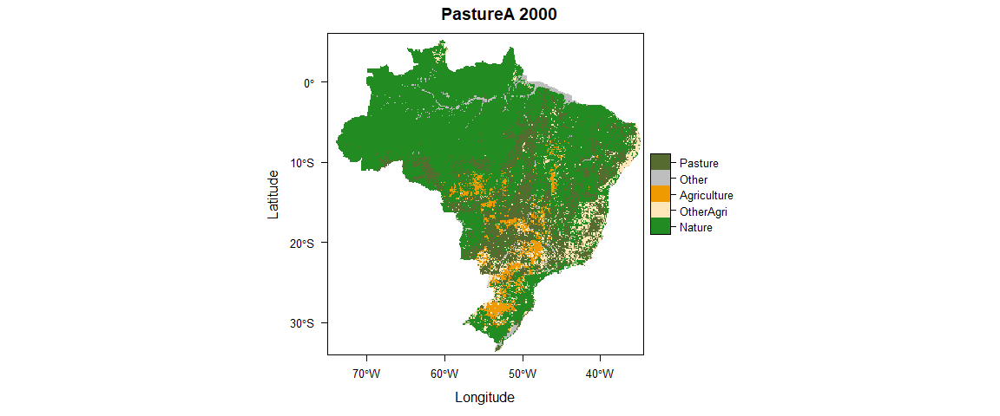<!-- -->

```
## [1] "PastureB"
```

<!-- -->


##Pasture area by state, year and classification

```r
#add classification lable to the CData tables
for(i in seq_along(cls)){
  
  CData_ls[[i]] <- CData_ls[[i]] %>%
    mutate(classification = cls[i])
}

#union the CData tables for the different classifications
for(i in seq_along(cls)){
  
  if(i == 1) { CDataU <- CData_ls[[i]] }
  else { CDataU <- dplyr::union(CDataU, CData_ls[[i]]) }
}

#filter to pasture only
CData_Pas <- CDataU %>%
  dplyr::filter(LC == "Pasture")
```


```r
CData_Pas %>% 
  dplyr::filter(source == "Map") %>%
  ggplot(aes(x=classification, y=area, fill=classification)) + 
    geom_bar(stat="identity", colour="white", position = "dodge") +
    scale_y_continuous(name=expression(Area~km^{2}), labels = scales::comma) +
  #labs(x=expression(Data~Source),y=expression(Area~km^{2})) +
    facet_grid(year~state) +
    xlab("") +
    #ylab("Pasture Area km2") +
    theme(axis.text.x = element_blank()) +
  ggtitle("Map")
```

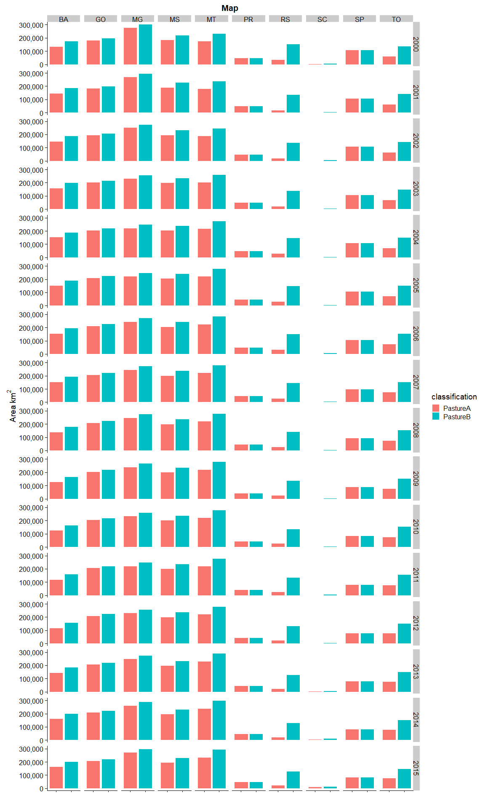<!-- -->

```r
CData_Pas %>% 
  dplyr::filter(source == "MB") %>%
  ggplot(aes(x=classification, y=area, fill=classification)) + 
    geom_bar(stat="identity", colour="white", position = "dodge") +
    scale_y_continuous(name=expression(Area~km^{2}), labels = scales::comma) +
    facet_grid(year~state) +
    xlab("")+
    #ylab("Pasture Area km2") +
    theme(axis.text.x = element_blank()) +
  ggtitle("MB")
```

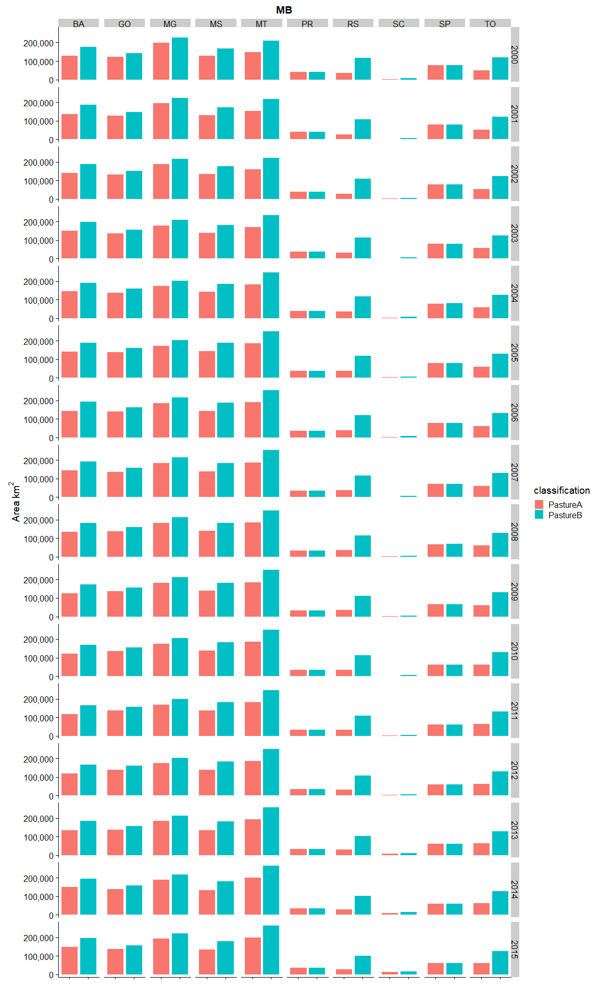<!-- -->


```r
#Load Production Data
meat_prod_Astates <- read_excel("Data/Cattle_meat_production_Kg_2000_2017_all_states.xlsx", sheet = "Plan1", skip = 1)  #data for all states Astates
```


```r
#join to pasture areas
meat_areas <- inner_join(CData_Pas, meat_prod_Fstates_long, by = c("year", "state"))

#calculate intensities (yields)
meat_areas <- meat_areas %>%
  mutate(intensity = kg / area)
```


###Production (from Pasture) by state, year and classification

Differentiated between original 30m MapBiomas reported data ( _MB_ ) and our aggregated 5km map data ( _map_ ) and

The next two plots have the same variables on the y-axis (Yield) but the second plot is differently scaled (some bars are not plotted because their value is greater than the limit of the axis).

```r
meat_areas %>% 
  filter(source == "Map") %>%
  ggplot(aes(x=classification, y=intensity, fill=classification)) + 
    geom_bar(stat="identity", colour="white", position = "dodge") +
    scale_y_continuous(name=expression(Yield~kg~km^{2}),limits = c(0, 30000)) +
    facet_grid(year~state) +
    xlab("")+
    theme(axis.text.x = element_blank()) +
  ggtitle("Meat, Map")
```

```
## Warning: Removed 9 rows containing missing values (geom_bar).
```

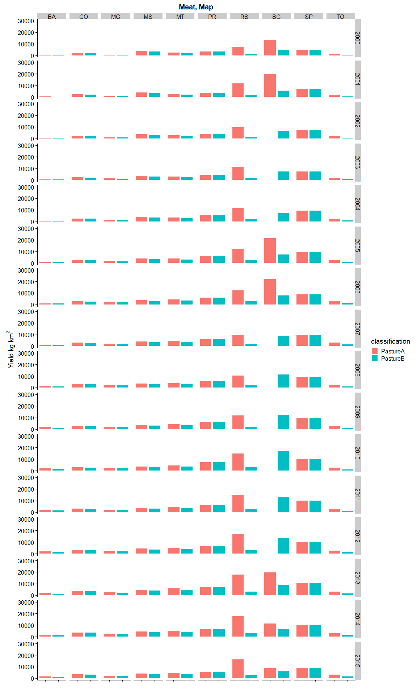<!-- -->

```r
meat_areas %>% 
  filter(source == "MB") %>%
  ggplot(aes(x=classification, y=intensity, fill=classification)) + 
    geom_bar(stat="identity", colour="white", position = "dodge") +
    scale_y_continuous(name=expression(Yield~kg~km^{2}),limits = c(0, 30000)) +
    facet_grid(year~state) +
    xlab("") +
    theme(axis.text.x = element_blank()) +
  ggtitle("Meat, MB")
```

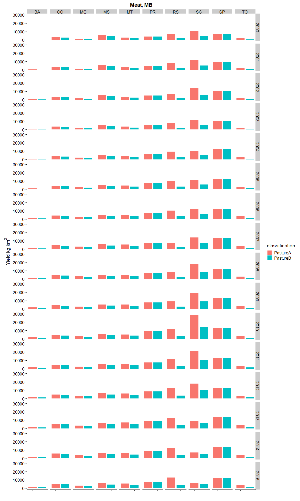<!-- -->

We see SC, SP and RS are all high relative to other states. We also see that yields are generally greatest for _PatureA_ classification and lower for _PastureB_ (which include MapBiomas' _Grassland_ in our definition of Pasture.


##Summary stats over time
Now let's summarise the data over time and examine their means and medians (with variation - error bar is one SE)


```r
meat_summary %>%
  #filter(source == "MB") %>%
  ggplot(aes(x=classification, y=int_mn, fill=classification)) + 
  geom_errorbar(aes(ymin=int_mn-int_se, ymax=int_mn+int_se), width=.1) +
  geom_bar(stat="identity", colour="white", position = "dodge") +
  facet_grid(source~state) +
  scale_y_continuous(name=expression(Yield~kg~km^{2}), labels = scales::comma) +
  xlab("")+
  theme(axis.text.x = element_blank()) +
  ggtitle("Meat, Mean")
```

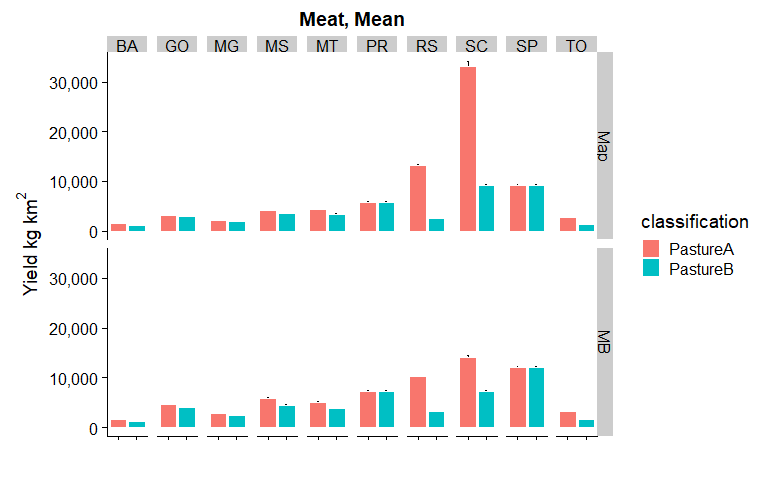<!-- -->

```r
meat_summary %>%
  #filter(source == "Map") %>%
  ggplot(aes(x=classification, y=int_md, fill=classification)) + 
  geom_errorbar(aes(ymin=int_md-int_se, ymax=int_md+int_se), width=.1) +
  geom_bar(stat="identity", colour="white", position = "dodge") +
  facet_grid(source~state) +
  scale_y_continuous(name=expression(Yield~kg~km^{2}), labels = scales::comma) +
  xlab("")+
  theme(axis.text.x = element_blank()) +
  ggtitle("Meat, Median")
```

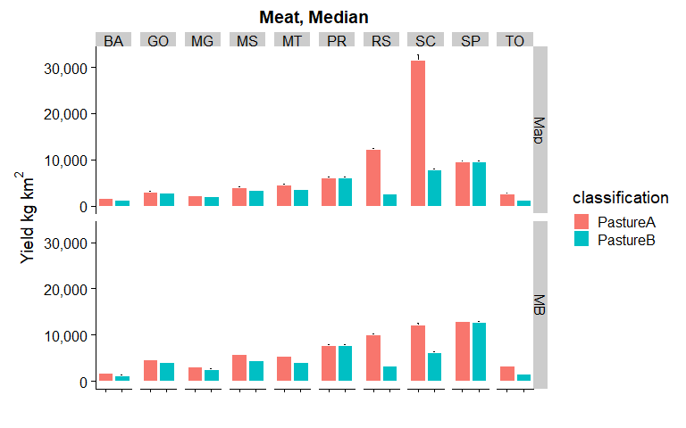<!-- -->

```r
meat_summary %>%
  #filter(source == "Map") %>%
  ggplot(aes(x=classification, y=int_max, fill=classification)) + 
  #geom_errorbar(aes(ymin=int_md-int_se, ymax=int_md+int_se), width=.1) +
  geom_bar(stat="identity", colour="white", position = "dodge") +
  facet_grid(source~state) +
  scale_y_continuous(name=expression(Yield~kg~km^{2}), labels = scales::comma) +
  xlab("")+
  theme(axis.text.x = element_blank()) +
  ggtitle("Meat, Maxima")
```

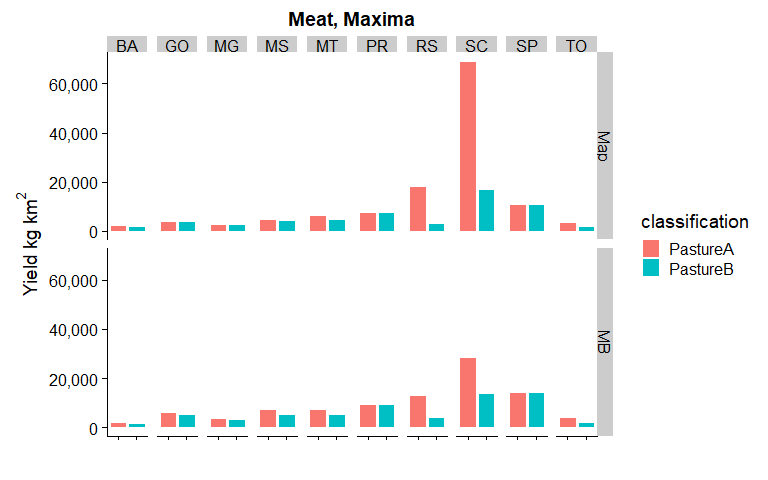<!-- -->

Again we see the same patterns; SC, SP and RS are greater than other states and _PastureA_ > _PastureB_.

If we plot again, but this time limiting the y-axis to 15,000 kg/km2 (max at 20,000)

```r
meat_summary %>%
  #filter(source == "MB") %>%
  ggplot(aes(x=classification, y=int_mn, fill=classification)) + 
  geom_errorbar(aes(ymin=int_mn-int_se, ymax=int_mn+int_se), width=.1) +
  geom_bar(stat="identity", colour="white", position = "dodge") +
  facet_grid(source~state) +
  scale_y_continuous(name=expression(Yield~kg~km^{2}), labels = scales::comma,limits = c(0, 15000)) +
  xlab("")+
  theme(axis.text.x = element_blank()) +
  ggtitle("Meat, Mean")
```

```
## Warning: Removed 1 rows containing missing values (geom_errorbar).
```

```
## Warning: Removed 1 rows containing missing values (geom_bar).
```

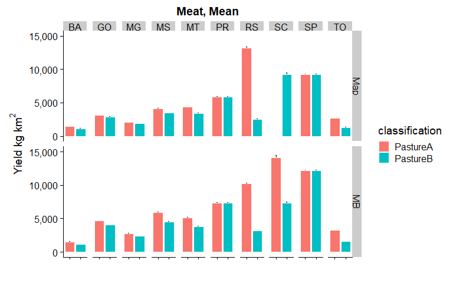<!-- -->

```r
meat_summary %>%
  #filter(source == "Map") %>%
  ggplot(aes(x=classification, y=int_md, fill=classification)) + 
  geom_errorbar(aes(ymin=int_md-int_se, ymax=int_md+int_se), width=.1) +
  geom_bar(stat="identity", colour="white", position = "dodge") +
  facet_grid(source~state) +
  scale_y_continuous(name=expression(Yield~kg~km^{2}), labels = scales::comma,limits = c(0, 15000)) +
  xlab("")+
  theme(axis.text.x = element_blank()) +
  ggtitle("Meat, Median")
```

```
## Warning: Removed 1 rows containing missing values (geom_errorbar).

## Warning: Removed 1 rows containing missing values (geom_bar).
```

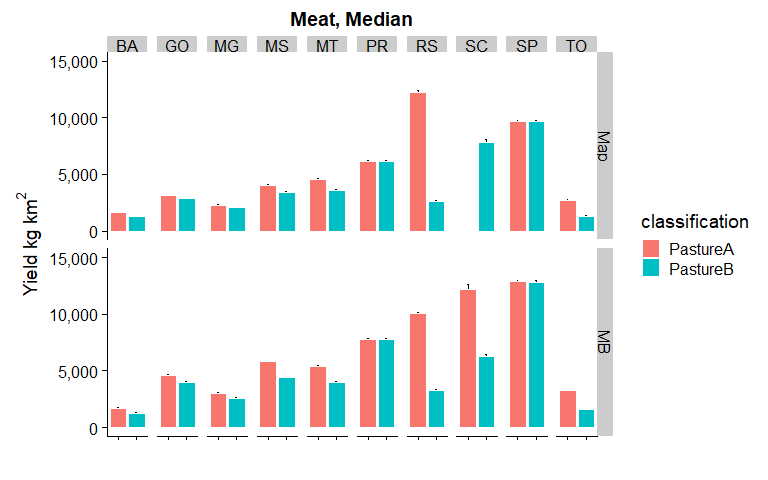<!-- -->

```r
meat_summary %>%
  #filter(source == "Map") %>%
  ggplot(aes(x=classification, y=int_max, fill=classification)) + 
  #geom_errorbar(aes(ymin=int_md-int_se, ymax=int_md+int_se), width=.1) +
  geom_bar(stat="identity", colour="white", position = "dodge") +
  facet_grid(source~state) +
  scale_y_continuous(name=expression(Yield~kg~km^{2}), labels = scales::comma,limits = c(0, 20000)) +
  xlab("")+
  theme(axis.text.x = element_blank()) +
  ggtitle("Meat, Maxima")
```

```
## Warning: Removed 2 rows containing missing values (geom_bar).
```

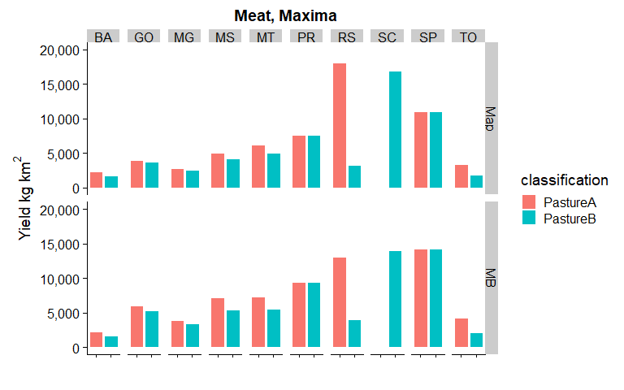<!-- -->

We can now more clearly compare classifications. In some states (PR, SP) _PastureA_ and _PastureB_ are very similar yield values, but in many others _PastureB_ is lower. We also see that yields are greater for  _MB_ data compared to _Map_. (NB: _PastureB_ for SC is very similar for MB data)

Using the _PastureB_ classification the 'perfect' meat yield would be ~9,200 kg km2 if using mean/median or ~11,000 if using max (see raw tables of summary data below)


```r
meat_summary %>%
  filter(source == "Map" & classification == "PastureB") %>%
  dplyr::select(-starts_with("prod"), -int_sd, -int_se) %>%
  filter(state != "SC") 
```

<div data-pagedtable="false">
  <script data-pagedtable-source type="application/json">
{"columns":[{"label":["state"],"name":[1],"type":["chr"],"align":["left"]},{"label":["classification"],"name":[2],"type":["chr"],"align":["left"]},{"label":["source"],"name":[3],"type":["chr"],"align":["left"]},{"label":["area_mn"],"name":[4],"type":["dbl"],"align":["right"]},{"label":["area_md"],"name":[5],"type":["dbl"],"align":["right"]},{"label":["area_sd"],"name":[6],"type":["dbl"],"align":["right"]},{"label":["int_mn"],"name":[7],"type":["dbl"],"align":["right"]},{"label":["int_md"],"name":[8],"type":["dbl"],"align":["right"]},{"label":["int_max"],"name":[9],"type":["dbl"],"align":["right"]}],"data":[{"1":"BA","2":"PastureB","3":"Map","4":"185330","5":"190238","6":"14493","7":"1151","8":"1272","9":"1710"},{"1":"GO","2":"PastureB","3":"Map","4":"220059","5":"223062","6":"9109","7":"2913","8":"2893","9":"3764"},{"1":"MG","2":"PastureB","3":"Map","4":"273078","5":"274412","6":"17617","7":"1871","8":"2070","9":"2576"},{"1":"MS","2":"PastureB","3":"Map","4":"237114","5":"238938","6":"5595","7":"3514","8":"3442","9":"4206"},{"1":"MT","2":"PastureB","3":"Map","4":"275080","5":"281712","6":"19073","7":"3433","8":"3627","9":"4967"},{"1":"PR","2":"PastureB","3":"Map","4":"48111","5":"48988","6":"2616","7":"5867","8":"6187","9":"7566"},{"1":"RS","2":"PastureB","3":"Map","4":"141067","5":"140112","6":"7721","7":"2560","8":"2662","9":"3240"},{"1":"SP","2":"PastureB","3":"Map","4":"96908","5":"96962","6":"12762","7":"9200","8":"9637","9":"11012"},{"1":"TO","2":"PastureB","3":"Map","4":"151998","5":"153412","6":"4818","7":"1336","8":"1339","9":"1820"}],"options":{"columns":{"min":{},"max":[10]},"rows":{"min":[10],"max":[10]},"pages":{}}}
  </script>
</div>


Or, mean of maxima (without SC) is ~4,500


```r
meat_summary %>%
  filter(source == "Map" & classification == "PastureB") %>%
  dplyr::select(-starts_with("prod"), -int_sd, -int_se) %>%
  filter(state != "SC") %>%
  group_by(classification) %>%
  summarise_at(vars(int_max), mean)
```

<div data-pagedtable="false">
  <script data-pagedtable-source type="application/json">
{"columns":[{"label":["classification"],"name":[1],"type":["chr"],"align":["left"]},{"label":["int_max"],"name":[2],"type":["dbl"],"align":["right"]}],"data":[{"1":"PastureB","2":"4540.111"}],"options":{"columns":{"min":{},"max":[10]},"rows":{"min":[10],"max":[10]},"pages":{}}}
  </script>
</div>

Values for _PastureB_ seem reasonable and align well with expected future yields (important to have a max contemporary yield that is feasible in future, to be able to run the model into the future). For example, [this report](http://csr.ufmg.br/pecuaria/portfolio-item/cenarios-para-o-brasil/). All in Portuguese, but the tables and figures is not hard to understand expects yields of 8,730kg/km2 in 2030 if the Brazilian sector continues to modernize (in "Produção de @/hectare" @ is equivalent to 15kg). This potential aligns well with the median intensity of 9,100kg/km2.

However, given that we want some indication of 'perfect', and to allow room for scenarios of extraordinary continued yield improvement) we will use the higher value of 11,000 kg/sq km as 'perfect' when calibrating (the maximum of all states bar SC in PastureB land cover re-classification)

In turn, 11,000 kg/sq km == **0.275 gg/25sq km**  We will use this value as a single unit of of 'Pasture service' from CRAFTY. 

Full meat summary data table for reference:


```r
kable(arrange(meat_summary, desc(int_mn), state, classification), caption="Meat data, sorted on mean production values descending")
```


Table: Meat data, sorted on mean production values descending

state   classification   source    area_mn   area_md   area_sd     prod_mn      prod_md     prod_sd   int_mn   int_md   int_max   int_sd     int_se
------  ---------------  -------  --------  --------  --------  ----------  -----------  ----------  -------  -------  --------  -------  ---------
SC      PastureA         Map          3144      2175      2656    74131260     73967400    21868077    33072    31647     69329    18435   1152.179
SC      PastureA         MB           6009      4734      3375    74131260     73967400    21868077    14079    12221     28532     5689    355.539
RS      PastureA         Map         27769     27562      5014   359173016    383339288    72758858    13197    12254     18091     3099    193.717
SP      PastureA         MB          72811     72982      8244   878686400    885858229   119385323    12191    12844     14264     1883    117.663
SP      PastureB         MB          72872     73064      8246   878686400    885858229   119385323    12181    12834     14254     1881    117.584
RS      PastureA         MB          35380     35848      3905   359173016    383339288    72758858    10197    10047     13103     2099    131.188
SC      PastureB         Map          8431      7325      2603    74131260     73967400    21868077     9245     7849     16891     3373    210.792
SP      PastureA         Map         96892     96938     12772   878686400    885858229   119385323     9202     9637     11016     1534     95.869
SP      PastureB         Map         96908     96962     12762   878686400    885858229   119385323     9200     9637     11012     1533     95.801
SC      PastureB         MB          10558      9354      3361    74131260     73967400    21868077     7345     6239     14050     2613    163.312
PR      PastureA         MB          38772     39042      2489   280084706    288614877    49929771     7306     7776      9448     1599     99.965
PR      PastureB         MB          38773     39043      2489   280084706    288614877    49929771     7306     7776      9448     1599     99.964
MS      PastureA         MB         140393    140576      4251   833020798    816012972    77083654     5938     5787      7200      578     36.142
PR      PastureA         Map         48111     48988      2616   280084706    288614877    49929771     5867     6187      7566     1222     76.394
PR      PastureB         Map         48111     48988      2616   280084706    288614877    49929771     5867     6187      7566     1222     76.394
MT      PastureA         MB         183946    188248     15110   958318285   1020597324   289662995     5125     5427      7355     1248     78.018
GO      PastureA         MB         138150    139554      4854   643774060    655177836   123381231     4644     4631      6013      797     49.808
MS      PastureB         MB         183896    184818      5083   833020798    816012972    77083654     4530     4436      5409      404     25.220
MT      PastureA         Map        216455    221850     18345   958318285   1020597324   289662995     4353     4600      6209     1048     65.507
MS      PastureA         Map        200350    201550      5324   833020798    816012972    77083654     4159     4072      4969      378     23.611
GO      PastureB         MB         158894    159752      5393   643774060    655177836   123381231     4039     4009      5259      707     44.183
MT      PastureB         MB         248766    254522     16432   958318285   1020597324   289662995     3799     4012      5531      975     60.938
MS      PastureB         Map        237114    238938      5595   833020798    816012972    77083654     3514     3442      4206      322     20.148
MT      PastureB         Map        275080    281712     19073   958318285   1020597324   289662995     3433     3627      4967      871     54.410
TO      PastureA         MB          62120     64202      4264   204120756    208454298    57704451     3242     3250      4229      755     47.167
RS      PastureB         MB         114163    114683      6112   359173016    383339288    72758858     3159     3288      3979      690     43.123
GO      PastureA         Map        205253    208900      8725   643774060    655177836   123381231     3122     3112      4020      511     31.908
GO      PastureB         Map        220059    223062      9109   643774060    655177836   123381231     2913     2893      3764      484     30.266
MG      PastureA         MB         185439    186648      8655   508972814    555300819   154613474     2754     3034      3881      828     51.729
TO      PastureA         Map         74369     76375      6235   204120756    208454298    57704451     2703     2721      3427      594     37.131
RS      PastureB         Map        141067    140112      7721   359173016    383339288    72758858     2560     2662      3240      570     35.650
MG      PastureB         MB         215311    216750      8344   508972814    555300819   154613474     2370     2602      3374      712     44.507
MG      PastureA         Map        246389    246750     18155   508972814    555300819   154613474     2078     2306      2836      615     38.457
MG      PastureB         Map        273078    274412     17617   508972814    555300819   154613474     1871     2070      2576      551     34.411
TO      PastureB         MB         130148    131276      3763   204120756    208454298    57704451     1560     1572      2127      420     26.264
BA      PastureA         MB         139045    140580     10877   210624063    239675206    81054216     1533     1695      2248      622     38.902
BA      PastureA         Map        145261    148025     15042   210624063    239675206    81054216     1477     1622      2283      618     38.608
TO      PastureB         Map        151998    153412      4818   204120756    208454298    57704451     1336     1339      1820      358     22.403
BA      PastureB         Map        185330    190238     14493   210624063    239675206    81054216     1151     1272      1710      468     29.250
BA      PastureB         MB         186961    189788     10680   210624063    239675206    81054216     1135     1262      1607      452     28.263


```r
#if needed to remove ASCII folder
#unlink("ASCII", recursive = T) #delete ASCII directory created above
```
