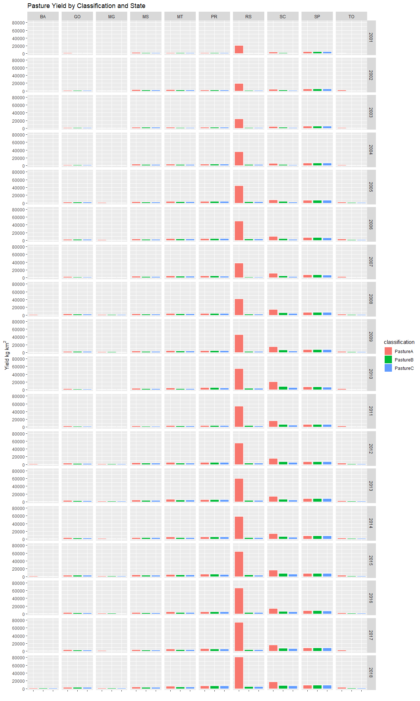
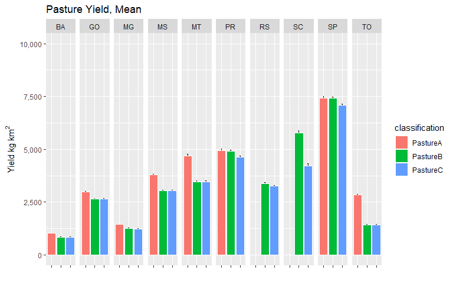
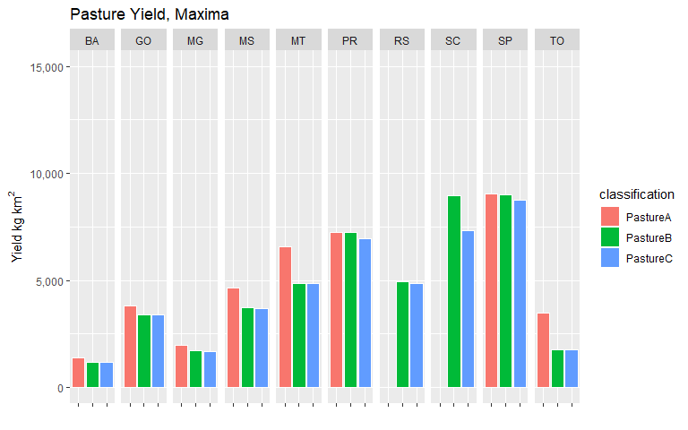

MapBiomas Classification Comparison
================
James D.A. Millington
Nov 2019

This document present code and analyses of pasture areas, meat production and pasture yield for all states 2001-2018, for three different classifications of the MapBiomas data both with and without disaggregation using planted area data.

See accompanying Excel file for the classifications. Input land cover data, including the classification and disaggregation processes, are created using the `ClassifyDisaggregateMap.r` script.

<details><summary>Show/Hide Code</summary>
<p>
``` r
rm(list=ls())

packages <- c(
  "tidyverse",
  "raster",
  "readxl",       #for reading Excel sheets
  "scales",       #useful for ggplotting
  "knitr",
  "rasterVis",    #more useful raster plotting
  "cowplot"       #useful for ggplotting
  )     
  
#use lapply to suppress all wanings: https://stackoverflow.com/a/46685042
invisible(lapply(packages, function(xxx) suppressMessages(require(xxx, character.only = TRUE,quietly=TRUE,warn.conflicts = FALSE))))
```

``` r
#raster to xyz  (with help from https://stackoverflow.com/a/19847419)
#sepcify input raster, whether nodata cells should be output, whether a unique cell ID should be added
#return is a matrix. note format is row (Y) then col (X)
extractXYZ <- function(raster, nodata = FALSE, addCellID = TRUE){
  
  vals <- raster::extract(raster, 1:ncell(raster))   #specify raster otherwise dplyr used
  xys <- rowColFromCell(raster,1:ncell(raster))
  combine <- cbind(xys,vals)
  
  if(addCellID){
    combine <- cbind(1:length(combine[,1]), combine)
  }
  
  if(!nodata){
    combine <- combine[!rowSums(!is.finite(combine)),]  #from https://stackoverflow.com/a/15773560
  }
  
  return(combine)
}


getLCs <- function(data)
{
  #calculates proportion of each LC in the muni (ignoring NAs, help from https://stackoverflow.com/a/44290753)
  data %>%
    group_by(muniID) %>%
    dplyr::summarise(LC1 = round(sum(map == 1, na.rm = T) / sum(!is.na(map)), 3),
                     LC2 = round(sum(map == 2, na.rm = T) / sum(!is.na(map)), 3),
                     LC3 = round(sum(map == 3, na.rm = T) / sum(!is.na(map)), 3),
                     LC4 = round(sum(map == 4, na.rm = T) / sum(!is.na(map)), 3),
                     LC5 = round(sum(map == 5, na.rm = T) / sum(!is.na(map)), 3),
                     NonNAs = sum(!is.na(map)),
                     NAs = sum(is.na(map))
    ) -> LCs

  return(LCs)
}
```

``` r
#unzip(zipfile="Data/sim10_BRmunis_latlon_5km_2018-04-27.zip",files="sim10_BRmunis_latlon_5km_2018-04-27.asc",exdir="ASCII")  # unzip file 
munis.r <- raster("Data/BaseMaps/sim10_BRmunis_latlon_5km.asc")  

#extract cell values to table format
munis.t <- extractXYZ(munis.r, addCellID = F)
munis.t <- as.data.frame(munis.t)
munis.t <- plyr::rename(munis.t, c("vals" = "muniID"))
```

``` r
#Specify classifications and years to examine. Classifications should be the names of Sheets in the Classifications Excel file. Years should be between 2001 and 2018

#classifications to loop through 
cls <- c("PastureA","PastureB","PastureC")

yrls <- seq(2001,2018,1)
```

``` r
#lists to hold data tables 
CData_ls <- vector('list', length(cls))
CDataW_ls <- vector('list', length(cls))
SDataW_ls <- vector('list', length(cls))
Stotals_ls <- vector('list', length(cls))
SDataW_Adj_ls <- vector('list', length(cls))
mapStack_ls <- vector('list', length(cls))

names(CData_ls) <- cls
names(CDataW_ls) <- cls
names(SDataW_ls) <- cls
names(Stotals_ls) <- cls
names(SDataW_Adj_ls) <- cls
names(mapStack_ls) <- cls

#i <- 1
#j <- 1

#loop over classifications
for(i in seq_along(cls)){
  
  classification <- read_excel("Data/MapBiomas_CRAFTY_classifications_v4.xlsx", sheet = cls[i], range="B1:C28", col_names=T) 
  
  #reset mapStack for this Classification
  mapStack <- stack()

  #loop over years  
  for(j in seq_along(yrls)){

    #read the classfied map to a raster  
    map <- raster(paste0("Data/Classified/LandCover",yrls[j],"_",cls[i],".asc"))
    
    #add categories for later plotting etc. (see https://stackoverflow.com/a/37214431)
    map <- ratify(map)     #tell R that the map raster is categorical 
    rat <- levels(map)[[1]]    #apply the levels (i.e. categories) 
   
    #not all classes may be present after classification, so conditionally construct labels
    labs <- c()
    if(1 %in% levels(map)[[1]]$ID) { labs <- c(labs, "Nature") }
    if(2 %in% levels(map)[[1]]$ID) { labs <- c(labs, "OtherAgri") }
    if(3 %in% levels(map)[[1]]$ID) { labs <- c(labs, "Agriculture") }
    if(4 %in% levels(map)[[1]]$ID) { labs <- c(labs, "Other") }
    if(5 %in% levels(map)[[1]]$ID) { labs <- c(labs, "Pasture") }
      
    rat$landcover <- labs  
    levels(map) <- rat 
    
    #add to mapStack for later plotting
    mapStack <- stack(map, mapStack)
  
    #extract cell values to table format
    map.t <- extractXYZ(map, addCellID = F)
    map.t <- as.data.frame(map.t)
    map.t <- plyr::rename(map.t, c("vals" = "map"))
  
    #so need to join 
    map_munis <- left_join(as.data.frame(munis.t), as.data.frame(map.t), by = c("row" = "row", "col" = "col"))
  
    #now summarise by muniID
    lcs_map_munis <- getLCs(map_munis)
  
    #convert cell counts to areas (km2) and add state id
    map_areas_munis <- lcs_map_munis %>%
      mutate(LC1area = round(LC1 * NonNAs) * 25) %>%
      mutate(LC2area = round(LC2 * NonNAs) * 25) %>%
      mutate(LC3area = round(LC3 * NonNAs) * 25) %>%
      mutate(LC4area = round(LC4 * NonNAs) * 25) %>%
      mutate(LC5area = round(LC5 * NonNAs) * 25) %>%
      mutate(state = substr(muniID, 1, 2))
  
    #drop original cell-count columns (work with area km2 from now on)
    map_areas_munis <- map_areas_munis %>% dplyr::select(-LC1, -LC2, -LC3, -LC4, -LC5, -NonNAs, -NAs)
  
    #summarise muni areas to state level
    map_areas <- map_areas_munis %>%
      group_by(state) %>%
      dplyr::summarise_at(vars(LC1area:LC5area),sum, na.rm=T) %>%  #use _at so state is not summarised
      mutate_if(is.character, as.integer)
  
    #gather to long format for union below
    map_areas <- map_areas %>%
      gather(key = LCa, value = area, -state)
    
    #recode LCs for union below
    map_areas <- map_areas %>%
      mutate(LC = if_else(LCa == "LC1area", 1, 
        if_else(LCa == "LC2area", 2,
        if_else(LCa == "LC3area", 3,
        if_else(LCa == "LC4area", 4,
        if_else(LCa == "LC5area", 5, 0)
        )))))
  
    #add source variable for plotting below (re-order to match map table for union below)
    map_areas <- map_areas %>%
      dplyr::select(-LCa) %>%
      mutate(source = "Map") %>%
      dplyr::select(state, LC, source, area)
  

    
     #relabel states to characters
    CData_yr <- map_areas %>%
      mutate(state = if_else(state == 17, "TO", 
        if_else(state == 29, "BA",
        if_else(state == 31, "MG",
        if_else(state == 35, "SP",
        if_else(state == 41, "PR",
        if_else(state == 42, "SC",
        if_else(state == 43, "RS", 
        if_else(state == 50, "MS",
        if_else(state == 51, "MT",
        if_else(state == 52, "GO", "NA"
        ))))))))))
      )
    
    #relabel LCs to characters
    CData_yr <- CData_yr %>%
      mutate(LC = if_else(LC == 1, "Nature", 
        if_else(LC == 2, "OtherAgri",
        if_else(LC == 3, "Agri",
        if_else(LC == 4, "Other",
        if_else(LC == 5, "Pasture", "NA"
        )))))
      )
    
    #add year column
    CData_yr <- CData_yr %>%
      mutate(year = yrls[j])
    
    #union CData for years here.
    #if first iteration of classification loop (re)create the tibble
    if(j == 1){
        CData <- CData_yr
    } else {
        #else join data to tibble (by creating another tibble, then join (ensure rows are not lost)
        CData <- union_all(CData, CData_yr)
    }
  }
  
  CData_ls[[i]] <- CData
  
  names(mapStack) <- yrls
  mapStack_ls[[i]] <- mapStack
}
```

</p>
</details>

Pre-Disaggregation Classiifcation
=================================

Maps
----

First, lets look at maps for the different classifications (for the final year) for quick visual comparison.

``` r
for(i in seq_along(mapStack_ls)){
  
  clabs <- c()
  if(1 %in% levels(mapStack_ls[[i]])[[1]]$ID) { clabs <- c(clabs, 'forestgreen') }
  if(2 %in% levels(mapStack_ls[[i]])[[1]]$ID) { clabs <- c(clabs, 'darkolivegreen') }
  if(3 %in% levels(mapStack_ls[[i]])[[1]]$ID) { clabs <- c(clabs, 'wheat1') }
  if(4 %in% levels(mapStack_ls[[i]])[[1]]$ID) { clabs <- c(clabs, 'gray') }
  if(5 %in% levels(mapStack_ls[[i]])[[1]]$ID) { clabs <- c(clabs, 'orange2') }
  
  #print(cls[i])
  
  #length(yrls) is the index of the final year
  #tail(yrls, n=1) is the 'label' for the final year
  print(rasterVis::levelplot(mapStack_ls[[i]][[length(yrls)]], pretty=T,att = 'landcover', col.regions=clabs, main=paste(cls[[i]], tail(yrls, n=1))))
  
}
```


From these maps, we can immediately see that *PastureA* has much less Pasture cover than the other two classifications.In particular, in the southern state of Rio Grande do Sul (RS) *PastureA* has much less Pasture areas as much of the state is classified as Grassland. The Grassland class is significant in Rio Grande do Sul because it is within the Pampa biome and has seen a long history of intense efforts by public and private groups to increase the (pasture) productivity of the grasslands.

As we will see below, this difference in classified land area leads to great differences in calculate pasture yields in RS. Other study area states have relatively small areas of grassland so are less affected by the inclusion, although Santa Catarina (a small state on the edge of the Pampa biome) is next most influenced.

Let's examine these differences between the classifications further quantitatively, looking at both total area and the yield implied when compared to production data.

Pasture area by state, year and classification
----------------------------------------------

The figure below shows again that generally the *PastureA* classification produces much less Pasture land area.

<details><summary>Show/Hide Code</summary>
<p>
``` r
#add classification lable to the CData tables
for(i in seq_along(cls)){
  
  CData_ls[[i]] <- CData_ls[[i]] %>%
    mutate(classification = cls[i])
}

#union the CData tables for the different classifications
for(i in seq_along(cls)){
  
  if(i == 1) { CDataU <- CData_ls[[i]] }
  else { CDataU <- dplyr::union(CDataU, CData_ls[[i]]) }
}

#filter to pasture only
CData_Pas <- CDataU %>%
  dplyr::filter(LC == "Pasture")
```

</p>
</details>

``` r
CData_Pas %>% 
  ggplot(aes(x=classification, y=area, fill=classification)) + 
    geom_bar(stat="identity", colour="white", position = "dodge") +
    scale_y_continuous(name=expression(Area~km^{2}), labels = scales::comma) +
    facet_grid(year~state) +
    xlab("") +
    theme(axis.text.x = element_blank()) +
    ggtitle("Pasture Area by Classification and State")
```


Pasture Yield by state, year and classification
-----------------------------------------------

This first plot below shows that *PastureA* for Rio Grande do Sul has vastly greater pasture yield than all other classification-state combinations.

<details><summary>Show/Hide Code</summary>
<p>
``` r
#Load Production Data
meat_prod_Astates <- read_excel("Data/Cattle_meat_production_Kg_2001_2018_all_states.xlsx", sheet = "Plan1", skip = 1)  #data for all states Astates
```

``` r
#join to pasture areas
meat_areas <- inner_join(CData_Pas, meat_prod_Fstates_long, by = c("year", "state"))

#calculate intensities (yields)
meat_areas <- meat_areas %>%
  mutate(intensity = kg / area)
```

</p>
</details>

``` r
meat_areas %>% 
  ggplot(aes(x=classification, y=intensity, fill=classification)) + 
    geom_bar(stat="identity", colour="white", position = "dodge") +
    scale_y_continuous(name=expression(Yield~kg~km^{2})) +
    facet_grid(year~state) +
    xlab("")+
    theme(axis.text.x = element_blank()) +
    ggtitle("Pasture Yield by Classification and State")
```



In fact, values are so large it is difficult to see variation for other states in this plot because of the y-axis scale, so let's repeat this plot but limiting the upper boundary of the yield plotted (to 15,000 kg km-2).

``` r
meat_areas %>% 
  ggplot(aes(x=classification, y=intensity, fill=classification)) + 
    geom_bar(stat="identity", colour="white", position = "dodge") +
    scale_y_continuous(name=expression(Yield~kg~km^{2}),limits = c(0, 15000)) +
    facet_grid(year~state) +
    xlab("")+
    theme(axis.text.x = element_blank()) +
    ggtitle("Pasture Yield by Classification and State (limited at 15,000 kg km-2")
```

    ## Warning: Removed 25 rows containing missing values (geom_bar).


Where bars are missing in the plot above, this is because the value for that bar is greater than 15,000. Now we can see more clearly, that in other states *PastureA* is also generally has the highest yield compared to the other classifications.

Summary stats over time
-----------------------

Now let's summarise the data over time and examine their means and medians (with variation - error bar is one SE) and maxima during 2001-2018.

<details><summary>Show/Hide Code</summary>
<p>
</p>
</details>

``` r
meat_summary %>%
  ggplot(aes(x=classification, y=int_mn, fill=classification)) + 
  geom_errorbar(aes(ymin=int_mn-int_se, ymax=int_mn+int_se), width=.1) +
  geom_bar(stat="identity", colour="white", position = "dodge") +
  facet_grid(.~state) +
  scale_y_continuous(name=expression(Yield~kg~km^{2}), limits = c(0, 10000), labels = scales::comma) +
  xlab("")+
  theme(axis.text.x = element_blank()) +
  ggtitle("Pasture Yield, Mean")
```

    ## Warning: Removed 2 rows containing missing values (geom_errorbar).

    ## Warning: Removed 2 rows containing missing values (geom_bar).



``` r
meat_summary %>%
  ggplot(aes(x=classification, y=int_md, fill=classification)) + 
  geom_errorbar(aes(ymin=int_md-int_se, ymax=int_md+int_se), width=.1) +
  geom_bar(stat="identity", colour="white", position = "dodge") +
  facet_grid(.~state) +
  scale_y_continuous(name=expression(Yield~kg~km^{2}), limits = c(0, 10000), labels = scales::comma) +
  xlab("")+
  theme(axis.text.x = element_blank()) +
  ggtitle("Pasture Yield, Median")
```

    ## Warning: Removed 2 rows containing missing values (geom_errorbar).

    ## Warning: Removed 2 rows containing missing values (geom_bar).


``` r
meat_summary %>%
  ggplot(aes(x=classification, y=int_max, fill=classification)) + 
  geom_bar(stat="identity", colour="white", position = "dodge") +
  facet_grid(.~state) +
  scale_y_continuous(name=expression(Yield~kg~km^{2}), limits = c(0, 15000), labels = scales::comma) +
  xlab("")+
  theme(axis.text.x = element_blank()) +
  ggtitle("Pasture Yield, Maxima")
```

    ## Warning: Removed 2 rows containing missing values (geom_bar).



In these three plots, we again we see the same pattern; *PastureA* produces greater yields than *PastureB* and *PastureC* (except for Sao Paolo state).

But how do these yields compare to observed and projected yields? The table below presents yields by state and classification (sorted descending on the maximum).

``` r
int_data <- meat_summary %>%
  dplyr::select(-starts_with("prod"), -starts_with("area")) 

kable(arrange(int_data, desc(int_max), state, classification), caption="Intensities, sorted on max values descending")
```

| state | classification | source |  int\_mn|  int\_md|  int\_max|  int\_sd|  int\_se|
|:------|:---------------|:-------|--------:|--------:|---------:|--------:|--------:|
| RS    | PastureA       | Map    |    49527|    52089|     81027|    17473|  970.708|
| SC    | PastureA       | Map    |    12605|    14628|     20830|     5139|  285.482|
| SP    | PastureA       | Map    |     7437|     7504|      9028|     1188|   66.012|
| SP    | PastureB       | Map    |     7422|     7491|      9006|     1184|   65.800|
| SC    | PastureB       | Map    |     5780|     6373|      8967|     2135|  118.606|
| SP    | PastureC       | Map    |     7091|     7093|      8752|     1172|   65.094|
| SC    | PastureC       | Map    |     4225|     4442|      7337|     1738|   96.548|
| PR    | PastureA       | Map    |     4944|     4741|      7259|     1259|   69.949|
| PR    | PastureB       | Map    |     4909|     4699|      7233|     1259|   69.920|
| PR    | PastureC       | Map    |     4620|     4443|      6966|     1234|   68.554|
| MT    | PastureA       | Map    |     4700|     4697|      6582|     1079|   59.959|
| RS    | PastureB       | Map    |     3378|     3701|      4943|      886|   49.226|
| MT    | PastureB       | Map    |     3473|     3550|      4852|      839|   46.590|
| MT    | PastureC       | Map    |     3473|     3550|      4852|      839|   46.590|
| RS    | PastureC       | Map    |     3256|     3548|      4835|      871|   48.388|
| MS    | PastureA       | Map    |     3788|     3671|      4637|      452|   25.133|
| GO    | PastureA       | Map    |     2976|     2914|      3811|      587|   32.621|
| MS    | PastureB       | Map    |     3055|     2984|      3711|      349|   19.390|
| MS    | PastureC       | Map    |     3045|     2974|      3698|      346|   19.237|
| TO    | PastureA       | Map    |     2845|     2949|      3461|      482|   26.779|
| GO    | PastureB       | Map    |     2646|     2536|      3398|      528|   29.348|
| GO    | PastureC       | Map    |     2640|     2529|      3391|      528|   29.357|
| MG    | PastureA       | Map    |     1443|     1510|      1977|      380|   21.118|
| TO    | PastureB       | Map    |     1428|     1526|      1761|      292|   16.244|
| TO    | PastureC       | Map    |     1428|     1526|      1761|      292|   16.244|
| MG    | PastureB       | Map    |     1256|     1312|      1724|      333|   18.490|
| MG    | PastureC       | Map    |     1227|     1283|      1686|      322|   17.901|
| BA    | PastureA       | Map    |     1022|     1156|      1388|      325|   18.080|
| BA    | PastureB       | Map    |      842|      955|      1158|      276|   15.316|
| BA    | PastureC       | Map    |      837|      948|      1153|      274|   15.237|

We can also calculate the mean state maximum across all years for each of the classifications:

``` r
meat_summary %>%
  dplyr::select(-starts_with("prod"), -int_sd, -int_se) %>%
  group_by(classification) %>%
  summarise_at(vars(int_max), mean)
```

    ## # A tibble: 3 x 2
    ##   classification int_max
    ##   <chr>            <dbl>
    ## 1 PastureA        14000 
    ## 2 PastureB         4675.
    ## 3 PastureC         4443.

Largest values for *PastureB* and *PastureC* seem reasonable and align well with expected future yields (important to have a max contemporary yield that is feasible in future, to be able to run the model into the future). For example, [this report](http://csr.ufmg.br/pecuaria/portfolio-item/cenarios-para-o-brasil/) expects yields of 8,730kg/km2 in 2030 if the Brazilian sector continues to modernize (in "Produção de @/hectare" @ is equivalent to 15kg). This potential aligns well with the maximum previously observed intensity of 9,100kg/km2 (which is likely an outlier given remaining uncertainty in land cover classification). Ultimately, the *PastureA* classification produces yield values which are just not feasible relatively to observed values.

Post-Disaggregation Classiifcation
==================================

Now that we have discounted the *PastureA* classification, let's examine *PastureB* and *PastureC* in more detail after they have been disaggregated using planted area data (see `ClassifyDisaggregateMap.r`). We'll repeat much of the above analysis, but using disaggregated maps as input.

<details><summary>Show/Hide Code</summary>
<p>
``` r
#Specify classifications and years to examine. Classifications should be the names of Sheets in the Classifications Excel file. Years should be between 2001 and 2018

#classifications to loop through 
cls <- c("PastureB","PastureC")

yrls <- seq(2001,2018,1)
```

``` r
#lists to hold data tables 
CData_ls <- vector('list', length(cls))
CDataW_ls <- vector('list', length(cls))
SDataW_ls <- vector('list', length(cls))
Stotals_ls <- vector('list', length(cls))
SDataW_Adj_ls <- vector('list', length(cls))
mapStack_ls <- vector('list', length(cls))

names(CData_ls) <- cls
names(CDataW_ls) <- cls
names(SDataW_ls) <- cls
names(Stotals_ls) <- cls
names(SDataW_Adj_ls) <- cls
names(mapStack_ls) <- cls

#i <- 1
#j <- 1

#loop over classifications
for(i in seq_along(cls)){
  
  classification <- read_excel("Data/MapBiomas_CRAFTY_classifications_v4.xlsx", sheet = cls[i], range="B1:C28", col_names=T) 
  
  #reset mapStack for this Classification
  mapStack <- stack()

  #loop over years  
  for(j in seq_along(yrls)){

    #read the classfied map to a raster  
    map <- raster(paste0("Data/Classified/LandCover",yrls[j],"_",cls[i],"_Disagg.asc"))
    
    #add categories for later plotting etc. (see https://stackoverflow.com/a/37214431)
    map <- ratify(map)     #tell R that the map raster is categorical 
    rat <- levels(map)[[1]]    #apply the levels (i.e. categories) 
   
    #not all classes may be present after classification, so conditionally construct labels
    labs <- c()
    if(1 %in% levels(map)[[1]]$ID) { labs <- c(labs, "Nature") }
    if(2 %in% levels(map)[[1]]$ID) { labs <- c(labs, "OtherAgri") }
    if(3 %in% levels(map)[[1]]$ID) { labs <- c(labs, "Agriculture") }
    if(4 %in% levels(map)[[1]]$ID) { labs <- c(labs, "Other") }
    if(5 %in% levels(map)[[1]]$ID) { labs <- c(labs, "Pasture") }
      
    rat$landcover <- labs  
    levels(map) <- rat 
    
    #add to mapStack for later plotting
    mapStack <- stack(map, mapStack)
  
    #extract cell values to table format
    map.t <- extractXYZ(map, addCellID = F)
    map.t <- as.data.frame(map.t)
    map.t <- plyr::rename(map.t, c("vals" = "map"))
  
    #so need to join 
    map_munis <- left_join(as.data.frame(munis.t), as.data.frame(map.t), by = c("row" = "row", "col" = "col"))
  
    #now summarise by muniID
    lcs_map_munis <- getLCs(map_munis)
  
    #convert cell counts to areas (km2) and add state id
    map_areas_munis <- lcs_map_munis %>%
      mutate(LC1area = round(LC1 * NonNAs) * 25) %>%
      mutate(LC2area = round(LC2 * NonNAs) * 25) %>%
      mutate(LC3area = round(LC3 * NonNAs) * 25) %>%
      mutate(LC4area = round(LC4 * NonNAs) * 25) %>%
      mutate(LC5area = round(LC5 * NonNAs) * 25) %>%
      mutate(state = substr(muniID, 1, 2))
  
    #drop original cell-count columns (work with area km2 from now on)
    map_areas_munis <- map_areas_munis %>% dplyr::select(-LC1, -LC2, -LC3, -LC4, -LC5, -NonNAs, -NAs)
  
    #summarise muni areas to state level
    map_areas <- map_areas_munis %>%
      group_by(state) %>%
      dplyr::summarise_at(vars(LC1area:LC5area),sum, na.rm=T) %>%  #use _at so state is not summarised
      mutate_if(is.character, as.integer)
  
    #gather to long format for union below
    map_areas <- map_areas %>%
      gather(key = LCa, value = area, -state)
    
    #recode LCs for union below
    map_areas <- map_areas %>%
      mutate(LC = if_else(LCa == "LC1area", 1, 
        if_else(LCa == "LC2area", 2,
        if_else(LCa == "LC3area", 3,
        if_else(LCa == "LC4area", 4,
        if_else(LCa == "LC5area", 5, 0)
        )))))
  
    #add source variable for plotting below (re-order to match map table for union below)
    map_areas <- map_areas %>%
      dplyr::select(-LCa) %>%
      mutate(source = "Map") %>%
      dplyr::select(state, LC, source, area)
  

    
     #relabel states to characters
    CData_yr <- map_areas %>%
      mutate(state = if_else(state == 17, "TO", 
        if_else(state == 29, "BA",
        if_else(state == 31, "MG",
        if_else(state == 35, "SP",
        if_else(state == 41, "PR",
        if_else(state == 42, "SC",
        if_else(state == 43, "RS", 
        if_else(state == 50, "MS",
        if_else(state == 51, "MT",
        if_else(state == 52, "GO", "NA"
        ))))))))))
      )
    
    #relabel LCs to characters
    CData_yr <- CData_yr %>%
      mutate(LC = if_else(LC == 1, "Nature", 
        if_else(LC == 2, "OtherAgri",
        if_else(LC == 3, "Agri",
        if_else(LC == 4, "Other",
        if_else(LC == 5, "Pasture", "NA"
        )))))
      )
    
    #add year column
    CData_yr <- CData_yr %>%
      mutate(year = yrls[j])
    
    #union CData for years here.
    #if first iteration of classification loop (re)create the tibble
    if(j == 1){
        CData <- CData_yr
    } else {
        #else join data to tibble (by creating another tibble, then join (ensure rows are not lost)
        CData <- union_all(CData, CData_yr)
    }
  }
  
  CData_ls[[i]] <- CData
  
  names(mapStack) <- yrls
  mapStack_ls[[i]] <- mapStack
}
```

``` r
#add classification lable to the CData tables
for(i in seq_along(cls)){
  
  CData_ls[[i]] <- CData_ls[[i]] %>%
    mutate(classification = cls[i])
}

#union the CData tables for the different classifications
for(i in seq_along(cls)){
  
  if(i == 1) { CDataU <- CData_ls[[i]] }
  else { CDataU <- dplyr::union(CDataU, CData_ls[[i]]) }
}

#filter to pasture only
CData_Pas <- CDataU %>%
  dplyr::filter(LC == "Pasture")
```

``` r
#join to pasture areas
meat_areas <- inner_join(CData_Pas, meat_prod_Fstates_long, by = c("year", "state"))

#calculate intensities (yields)
meat_areas <- meat_areas %>%
  mutate(intensity = kg / area)
```

</p>
</details>

Pasture Yield by state, year and classification
-----------------------------------------------

We see that in general there is little difference between the two classifications; Santa Catarina state has possibly the largest differences with *PastureB* resulting in greater Pasture yields.

``` r
meat_areas %>% 
  #filter(source == "Map") %>%
  ggplot(aes(x=classification, y=intensity, fill=classification)) + 
    geom_bar(stat="identity", colour="white", position = "dodge") +
    scale_y_continuous(name=expression(Yield~kg~km^{2})) +
    facet_grid(year~state) +
    xlab("")+
    theme(axis.text.x = element_blank()) +
    ggtitle("Pasture Yield by Classification and State")
```


Summary stats over time
-----------------------

Now let's summarise the data over time again, and examine their means and medians (with variation - error bar is one SE) and maxima during 2001-2018.

<details><summary>Show/Hide Code</summary>
<p>
</p>
</details>

``` r
meat_summary %>%
  #filter(source == "MB") %>%
  ggplot(aes(x=classification, y=int_mn, fill=classification)) + 
  geom_errorbar(aes(ymin=int_mn-int_se, ymax=int_mn+int_se), width=.1) +
  geom_bar(stat="identity", colour="white", position = "dodge") +
  facet_grid(.~state) +
  scale_y_continuous(name=expression(Yield~kg~km^{2}), limits = c(0, 10000), labels = scales::comma) +
  xlab("")+
  theme(axis.text.x = element_blank()) +
  ggtitle("Pasture Yield, Mean")
```


``` r
meat_summary %>%
  #filter(source == "Map") %>%
  ggplot(aes(x=classification, y=int_md, fill=classification)) + 
  geom_errorbar(aes(ymin=int_md-int_se, ymax=int_md+int_se), width=.1) +
  geom_bar(stat="identity", colour="white", position = "dodge") +
  facet_grid(.~state) +
  scale_y_continuous(name=expression(Yield~kg~km^{2}), limits = c(0, 10000), labels = scales::comma) +
  xlab("")+
  theme(axis.text.x = element_blank()) +
  ggtitle("Pasture Yield, Median")
```


``` r
meat_summary %>%
  #filter(source == "Map") %>%
  ggplot(aes(x=classification, y=int_max, fill=classification)) + 
  #geom_errorbar(aes(ymin=int_md-int_se, ymax=int_md+int_se), width=.1) +
  geom_bar(stat="identity", colour="white", position = "dodge") +
  facet_grid(.~state) +
  scale_y_continuous(name=expression(Yield~kg~km^{2}), limits = c(0, 10000), labels = scales::comma) +
  xlab("")+
  theme(axis.text.x = element_blank()) +
  ggtitle("Pasture Yield, Maxima")
```


As above, when looking at summaries we see that the two classifications are generally similar, but with *PastureB* producing more land area, notably for Santa Catarina, Sao Paolo and Parana.

Let's look again at yields by state and classification (sorted descending on the maximum).

``` r
int_data <- meat_summary %>%
  #filter(source == "Map") %>%
  dplyr::select(-starts_with("prod"), -starts_with("area")) #%>%
  #filter(state != "SC") 

kable(arrange(int_data, desc(int_max), state, classification), caption="Intensities, sorted on max values descending")
```

| state | classification | source |  int\_mn|  int\_md|  int\_max|  int\_sd|  int\_se|
|:------|:---------------|:-------|--------:|--------:|---------:|--------:|--------:|
| SC    | PastureB       | Map    |     5872|     6485|      9126|     2177|  120.966|
| SP    | PastureB       | Map    |     7462|     7533|      9063|     1193|   66.253|
| SP    | PastureC       | Map    |     7132|     7133|      8811|     1181|   65.594|
| SC    | PastureC       | Map    |     4286|     4509|      7449|     1768|   98.217|
| PR    | PastureB       | Map    |     4947|     4739|      7285|     1267|   70.412|
| PR    | PastureC       | Map    |     4661|     4485|      7022|     1244|   69.100|
| MT    | PastureB       | Map    |     3741|     3811|      5218|      902|   50.090|
| MT    | PastureC       | Map    |     3741|     3811|      5218|      902|   50.090|
| RS    | PastureB       | Map    |     3393|     3718|      4963|      890|   49.430|
| RS    | PastureC       | Map    |     3275|     3569|      4856|      874|   48.581|
| MS    | PastureB       | Map    |     3093|     3024|      3751|      351|   19.508|
| MS    | PastureC       | Map    |     3084|     3015|      3740|      349|   19.366|
| GO    | PastureB       | Map    |     2685|     2572|      3452|      538|   29.880|
| GO    | PastureC       | Map    |     2678|     2566|      3444|      538|   29.889|
| TO    | PastureB       | Map    |     1725|     1836|      2131|      345|   19.156|
| TO    | PastureC       | Map    |     1725|     1836|      2131|      345|   19.156|
| MG    | PastureB       | Map    |     1274|     1330|      1749|      338|   18.762|
| MG    | PastureC       | Map    |     1244|     1301|      1711|      327|   18.160|
| BA    | PastureB       | Map    |      860|      975|      1181|      281|   15.626|
| BA    | PastureC       | Map    |      855|      968|      1176|      280|   15.546|

And the mean state maximum across all years for each of the classifications:

``` r
meat_summary %>%
  #filter(source == "Map" & classification == "PastureB") %>%
  dplyr::select(-starts_with("prod"), -int_sd, -int_se) %>%
  #filter(state != "SC") %>%
  group_by(classification) %>%
  summarise_at(vars(int_max), mean)
```

    ## # A tibble: 2 x 2
    ##   classification int_max
    ##   <chr>            <dbl>
    ## 1 PastureB         4792.
    ## 2 PastureC         4556.

Yield values are generally quite similar to those calculated for non-disaggregated maps.

So, overall there is not much difference between the two classifications. We we will chose the *PastureB* classification as it seems to make more sense to include the MapBiomas *Mosaic of Agriculture and Pasture* class as Agriculture prior to disaggregation (given the disaggregation process used).

CRAFTY Service Provision
------------------------

Having chosem the *PastureB* classification, we now need to identify the some indication of 'perfect' yield in our data to enable conversion of meat production (in kg) to CRAFTY service production units. We could use the maximum yield observed in our data (~9,100 kg/sq km) but to allow room for future scenarios of extraordinary continued yield improvement, we will use a higher value of 11,000 kg/sq km. In turn, 11,000 kg/sq km == **0.275 gg/25sq km** We will use this value as a single unit of of 'Pasture service' from CRAFTY.
