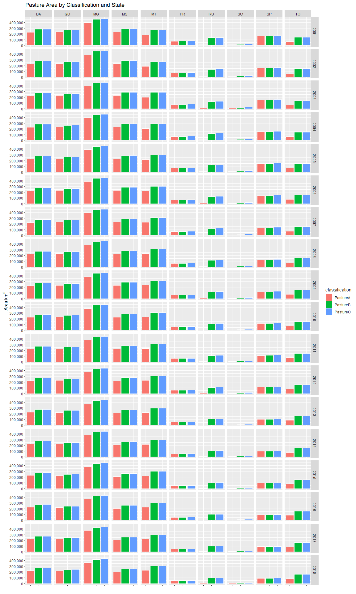
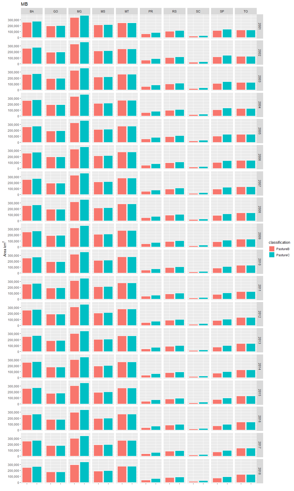
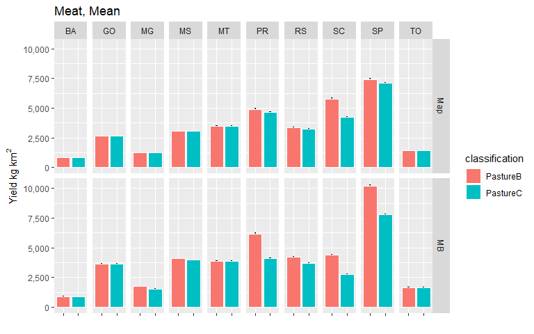
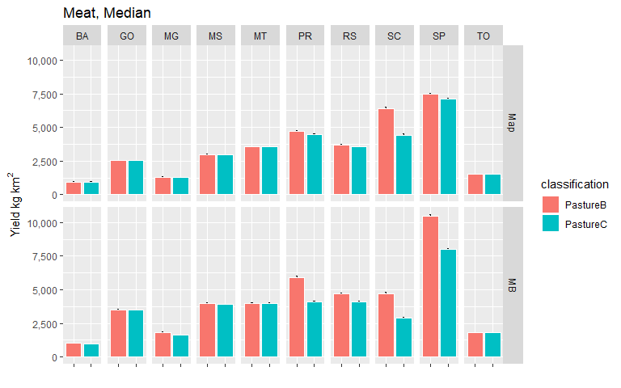
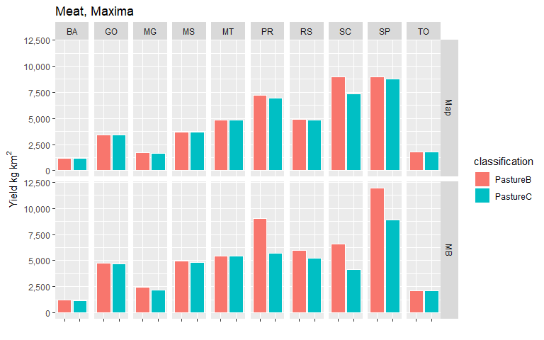

MapBiomas Classification - Pasture Analysis
================
James D.A. Millington
Oct 2019

This script analyses pasture areas, meat production and meat 'yield' (intensity) for all states and years, for two different classifications of the MapBiomas data - one that includes 'Grassland' in our 'Pasture' class and one that does not (plus disaggregation of some classes using planted area data). See accompanying Excel file for the classifications. Below the two data sources:

-   *MB* is the original 30m MapBiomas data
-   *Map* is our aggregated 5km map data

``` r
rm(list=ls())

packages <- c(
  "tidyverse",
  "raster",
  "readxl",       #for reading Excel sheets
  "scales",       #useful for ggplotting
  "knitr",
  "rasterVis",    #more useful raster plotting
  "cowplot"       #useful for ggplotting
  )     
  
#use lapply to suppress all wanings: https://stackoverflow.com/a/46685042
invisible(lapply(packages, function(xxx) suppressMessages(require(xxx, character.only = TRUE,quietly=TRUE,warn.conflicts = FALSE))))
```

``` r
#raster to xyz  (with help from https://stackoverflow.com/a/19847419)
#sepcify input raster, whether nodata cells should be output, whether a unique cell ID should be added
#return is a matrix. note format is row (Y) then col (X)
extractXYZ <- function(raster, nodata = FALSE, addCellID = TRUE){
  
  vals <- raster::extract(raster, 1:ncell(raster))   #specify raster otherwise dplyr used
  xys <- rowColFromCell(raster,1:ncell(raster))
  combine <- cbind(xys,vals)
  
  if(addCellID){
    combine <- cbind(1:length(combine[,1]), combine)
  }
  
  if(!nodata){
    combine <- combine[!rowSums(!is.finite(combine)),]  #from https://stackoverflow.com/a/15773560
  }
  
  return(combine)
}


getLCs <- function(data)
{
  #calculates proportion of each LC in the muni (ignoring NAs, help from https://stackoverflow.com/a/44290753)
  data %>%
    group_by(muniID) %>%
    dplyr::summarise(LC1 = round(sum(map == 1, na.rm = T) / sum(!is.na(map)), 3),
                     LC2 = round(sum(map == 2, na.rm = T) / sum(!is.na(map)), 3),
                     LC3 = round(sum(map == 3, na.rm = T) / sum(!is.na(map)), 3),
                     LC4 = round(sum(map == 4, na.rm = T) / sum(!is.na(map)), 3),
                     LC5 = round(sum(map == 5, na.rm = T) / sum(!is.na(map)), 3),
                     NonNAs = sum(!is.na(map)),
                     NAs = sum(is.na(map))
    ) -> LCs

  return(LCs)
}
```

``` r
#unzip(zipfile="Data/MapBiomas_23_ASCII_unclassified_allYears.zip")  # unzip all files 

#for 'suppressMessages' see https://stackoverflow.com/a/41229387
mb_data <- suppressMessages(read_csv("Data/Dados_Cobertura_MapBiomas_4.0_LAND_COVER-MUN_UF.csv"))

#unzip(zipfile="Data/sim10_BRmunis_latlon_5km_2018-04-27.zip",files="sim10_BRmunis_latlon_5km_2018-04-27.asc",exdir="ASCII")  # unzip file 
munis.r <- raster("Data/BaseMaps/sim10_BRmunis_latlon_5km.asc")  

#extract cell values to table format
munis.t <- extractXYZ(munis.r, addCellID = F)
munis.t <- as.data.frame(munis.t)
munis.t <- plyr::rename(munis.t, c("vals" = "muniID"))
```

``` r
#Specify classifications and years to examine. Classifications should be the names of Sheets in the Classifications Excel file. Years should be between 2000 and 2015 

#classifications to loop through 
cls <- c("PastureB", "PastureC")

yrls <- seq(2001,2018,1)
```

``` r
#lists to hold data tables 
CData_ls <- vector('list', length(cls))
CDataW_ls <- vector('list', length(cls))
SDataW_ls <- vector('list', length(cls))
Stotals_ls <- vector('list', length(cls))
SDataW_Adj_ls <- vector('list', length(cls))
mapStack_ls <- vector('list', length(cls))

names(CData_ls) <- cls
names(CDataW_ls) <- cls
names(SDataW_ls) <- cls
names(Stotals_ls) <- cls
names(SDataW_Adj_ls) <- cls
names(mapStack_ls) <- cls

#i <- 1
#j <- 1

#loop over classifications
for(i in seq_along(cls)){
  
  classification <- read_excel("Data/MapBiomas_CRAFTY_classifications_v4.xlsx", sheet = cls[i], range="B2:C28", col_names=F) 
  
  #reset mapStack for this Classification
  mapStack <- stack()

  #loop over years  
  for(j in seq_along(yrls)){

    #read the classfied map to a raster  
    map <- raster(paste0("Data/Classified/LandCover",yrls[j],"_",cls[i],"_Disagg.asc"))
    
    #add categories for later plotting etc. (see https://stackoverflow.com/a/37214431)
    map <- ratify(map)     #tell R that the map raster is categorical 
    rat <- levels(map)[[1]]    #apply the levels (i.e. categories) 
   
    #not all classes may be present after classification, so conditionally construct labels
    labs <- c()
    if(1 %in% levels(map)[[1]]$ID) { labs <- c(labs, "Nature") }
    if(2 %in% levels(map)[[1]]$ID) { labs <- c(labs, "OtherAgri") }
    if(3 %in% levels(map)[[1]]$ID) { labs <- c(labs, "Agriculture") }
    if(4 %in% levels(map)[[1]]$ID) { labs <- c(labs, "Other") }
    if(5 %in% levels(map)[[1]]$ID) { labs <- c(labs, "Pasture") }
      
    rat$landcover <- labs  
    levels(map) <- rat 
    
    #add to mapStack for later plotting
    mapStack <- stack(map, mapStack)
  
    #extract cell values to table format
    map.t <- extractXYZ(map, addCellID = F)
    map.t <- as.data.frame(map.t)
    map.t <- plyr::rename(map.t, c("vals" = "map"))
  
    #so need to join 
    map_munis <- left_join(as.data.frame(munis.t), as.data.frame(map.t), by = c("row" = "row", "col" = "col"))
  
    #now summarise by muniID
    lcs_map_munis <- getLCs(map_munis)
  
    #convert cell counts to areas (km2) and add state id
    map_areas_munis <- lcs_map_munis %>%
      mutate(LC1area = round(LC1 * NonNAs) * 25) %>%
      mutate(LC2area = round(LC2 * NonNAs) * 25) %>%
      mutate(LC3area = round(LC3 * NonNAs) * 25) %>%
      mutate(LC4area = round(LC4 * NonNAs) * 25) %>%
      mutate(LC5area = round(LC5 * NonNAs) * 25) %>%
      mutate(state = substr(muniID, 1, 2))
  
    #drop original cell-count columns (work with area km2 from now on)
    map_areas_munis <- map_areas_munis %>% dplyr::select(-LC1, -LC2, -LC3, -LC4, -LC5, -NonNAs, -NAs)
  
    #summarise muni areas to state level
    map_areas <- map_areas_munis %>%
      group_by(state) %>%
      dplyr::summarise_at(vars(LC1area:LC5area),sum, na.rm=T) %>%  #use _at so state is not summarised
      mutate_if(is.character, as.integer)
  
    #gather to long format for union below
    map_areas <- map_areas %>%
      gather(key = LCa, value = area, -state)
    
    #recode LCs for union below
    map_areas <- map_areas %>%
      mutate(LC = if_else(LCa == "LC1area", 1, 
        if_else(LCa == "LC2area", 2,
        if_else(LCa == "LC3area", 3,
        if_else(LCa == "LC4area", 4,
        if_else(LCa == "LC5area", 5, 0)
        )))))
  
    #add source variable for plotting below (re-order to match map table for union below)
    map_areas <- map_areas %>%
      dplyr::select(-LCa) %>%
      mutate(source = "Map") %>%
      dplyr::select(state, LC, source, area)
  
    ###Summarise MapBiomas data to the states we are simulating
  
    #filter to get only the states we want
    mb_areas <- mb_data %>%
      filter(estado == "TOCANTINS" | 
          estado == "BAHIA" |
          estado == "MINAS GERAIS" |
          estado == "SÃO PAULO" |
          estado == "PARANÁ" |
          estado == "SANTA CATARINA" |
          estado == "RIO GRANDE DO SUL" |
          estado == "MATO GROSSO DO SUL" |
          estado == "MATO GROSSO" |
          estado == "GOIÁS")
    
    #add state column containing state ids
    #mb_areas <- mb_areas %>%
    #  mutate(state = if_else(Estados == "TOCANTINS", 17, 
    #    if_else(Estados == "BAHIA", 29,
    #    if_else(Estados == "MINAS GERAIS", 31,
    #    if_else(Estados == "SÃO PAULO", 35,
    #    if_else(Estados == "PARANÁ", 41,
    #    if_else(Estados == "SANTA CATARINA", 42,
    #    if_else(Estados == "RIO GRANDE DO SUL", 43, 
    #    if_else(Estados == "MATO GROSSO DO SUL", 50, 
    #    if_else(Estados == "MATO GROSSO", 51,
    #    if_else(Estados == "GOIÁS", 52, 0
    #    ))))))))))
    #  )
    
        
    #select only columns we want    
    mb_areas <- mb_areas %>%
      dplyr::rename(state = COD_ESTADO) %>%
      dplyr::select(state, paste0(yrls[j]), `cod.classe`) %>% 
      dplyr::rename(area = paste0(yrls[j])) %>%
      dplyr::rename(LC = `cod.classe`) 
      
    
    #because there is no consistency between land cover labels
   # legenda = c("Forest Formations"=1, "Natural Forest Formations"=2, "Dense Forest"=3, "Savanna Formations"=4, "Mangroves"=5,"Forest Plantations"=9, "Non-Forest Natural Formations"=10, "Non Forest Wetlands"=11, "Grasslands"=12, "Other Non Forest Natural Formations"=13, "Farming"=14, "Pasture"=15, "Agriculture"=18, "Agriculture or Pasture"=21, "Non-Vegetated Areas"=22, "Dunes and Beaches"=23, "Urban Infrastructure"=24,"Other Non-Vegetated Area"=25,"Water Bodies"=26, "Non-Observed"=27)
    
    #recode to values (which match the map)
    #mb_areas <- mb_areas %>%
    #  mutate(LC = recode(`Classe Nivel 3`, !!!legenda))
    
    #use the classification values from above to relassify land covers
    mb_areas$LC <- plyr::mapvalues(mb_areas$LC, from=as.numeric(classification$X__1), to=as.numeric(classification$X__2))
    
    #calculate total LC area by state
    mb_areas <- mb_areas %>%
      group_by(state, LC) %>%
      dplyr::summarise_at(vars(area),sum, na.rm=T) 
    
    #convert ha to km2 and round to integer
    mb_areas <- mb_areas %>%
      mutate(area_km2 = round(area/100,0))  
    
    #add source variable for plotting below (re-order to match map table for union below)
    mb_areas <- mb_areas %>%
      dplyr::select(-area) %>%
      mutate(source = "MB") %>%
      rename(area = area_km2) %>%
      dplyr::select(state, LC, source, area)
      
  
    CData_yr <- union_all(map_areas, mb_areas)
  
    #relabel states to characters
    CData_yr <- CData_yr %>%
      mutate(state = if_else(state == 17, "TO", 
        if_else(state == 29, "BA",
        if_else(state == 31, "MG",
        if_else(state == 35, "SP",
        if_else(state == 41, "PR",
        if_else(state == 42, "SC",
        if_else(state == 43, "RS", 
        if_else(state == 50, "MS",
        if_else(state == 51, "MT",
        if_else(state == 52, "GO", "NA"
        ))))))))))
      )
    
    #relabel LCs to characters
    CData_yr <- CData_yr %>%
      mutate(LC = if_else(LC == 1, "Nature", 
        if_else(LC == 2, "OtherAgri",
        if_else(LC == 3, "Agri",
        if_else(LC == 4, "Other",
        if_else(LC == 5, "Pasture", "NA"
        )))))
      )
    
    #add year column
    CData_yr <- CData_yr %>%
      mutate(year = yrls[j])
    
    #union CData for years here.
    #if first iteration of classification loop (re)create the tibble
    if(j == 1){
        CData <- CData_yr
    } else {
        #else join data to tibble (by creating another tibble, then join (ensure rows are not lost)
        CData <- union_all(CData, CData_yr)
    }
  }
  
  CData_ls[[i]] <- CData
  
  names(mapStack) <- yrls
  mapStack_ls[[i]] <- mapStack
}
```

Maps
====

For 2001 for the different classifications (for quick visual comparison)

``` r
for(i in seq_along(mapStack_ls)){
  
  clabs <- c()
  if(1 %in% levels(mapStack_ls[[i]])[[1]]$ID) { clabs <- c(clabs, 'forestgreen') }
  if(2 %in% levels(mapStack_ls[[i]])[[1]]$ID) { clabs <- c(clabs, 'wheat1') }
  if(3 %in% levels(mapStack_ls[[i]])[[1]]$ID) { clabs <- c(clabs, 'orange2') }
  if(4 %in% levels(mapStack_ls[[i]])[[1]]$ID) { clabs <- c(clabs, 'gray') }
  if(5 %in% levels(mapStack_ls[[i]])[[1]]$ID) { clabs <- c(clabs, 'darkolivegreen') }
  
  print(cls[i])

  print(rasterVis::levelplot(mapStack_ls[[i]]$X2001, pretty=T,att = 'landcover', col.regions=clabs, main=paste0(cls[[i]], " 2001")))
  
}
```

    ## [1] "PastureB"


    ## [1] "PastureC"


Pasture area by state, year and classification
----------------------------------------------

``` r
#add classification lable to the CData tables
for(i in seq_along(cls)){
  
  CData_ls[[i]] <- CData_ls[[i]] %>%
    mutate(classification = cls[i])
}

#union the CData tables for the different classifications
for(i in seq_along(cls)){
  
  if(i == 1) { CDataU <- CData_ls[[i]] }
  else { CDataU <- dplyr::union(CDataU, CData_ls[[i]]) }
}

#filter to pasture only
CData_Pas <- CDataU %>%
  dplyr::filter(LC == "Pasture")
```

``` r
CData_Pas %>% 
  dplyr::filter(source == "Map") %>%
  ggplot(aes(x=classification, y=area, fill=classification)) + 
    geom_bar(stat="identity", colour="white", position = "dodge") +
    scale_y_continuous(name=expression(Area~km^{2}), labels = scales::comma) +
  #labs(x=expression(Data~Source),y=expression(Area~km^{2})) +
    facet_grid(year~state) +
    xlab("") +
    #ylab("Pasture Area km2") +
    theme(axis.text.x = element_blank()) +
  ggtitle("Map")
```



``` r
CData_Pas %>% 
  dplyr::filter(source == "MB") %>%
  ggplot(aes(x=classification, y=area, fill=classification)) + 
    geom_bar(stat="identity", colour="white", position = "dodge") +
    scale_y_continuous(name=expression(Area~km^{2}), labels = scales::comma) +
    facet_grid(year~state) +
    xlab("")+
    #ylab("Pasture Area km2") +
    theme(axis.text.x = element_blank()) +
  ggtitle("MB")
```



``` r
#Load Production Data
meat_prod_Astates <- read_excel("Data/Cattle_meat_production_Kg_2001_2018_all_states.xlsx", sheet = "Plan1", skip = 1)  #data for all states Astates
```

``` r
#join to pasture areas
meat_areas <- inner_join(CData_Pas, meat_prod_Fstates_long, by = c("year", "state"))

#calculate intensities (yields)
meat_areas <- meat_areas %>%
  mutate(intensity = kg / area)
```

### Production (from Pasture) by state, year and classification

Differentiated between original 30m MapBiomas reported data ( *MB* ) and our aggregated 5km map data ( *map* ) and

The next two plots have the same variables on the y-axis (Yield) but the second plot is differently scaled (some bars are not plotted because their value is greater than the limit of the axis).

``` r
meat_areas %>% 
  filter(source == "Map") %>%
  ggplot(aes(x=classification, y=intensity, fill=classification)) + 
    geom_bar(stat="identity", colour="white", position = "dodge") +
    scale_y_continuous(name=expression(Yield~kg~km^{2}),limits = c(0, 30000)) +
    facet_grid(year~state) +
    xlab("")+
    theme(axis.text.x = element_blank()) +
  ggtitle("Meat, Map")
```


``` r
meat_areas %>% 
  filter(source == "MB") %>%
  ggplot(aes(x=classification, y=intensity, fill=classification)) + 
    geom_bar(stat="identity", colour="white", position = "dodge") +
    scale_y_continuous(name=expression(Yield~kg~km^{2}),limits = c(0, 30000)) +
    facet_grid(year~state) +
    xlab("") +
    theme(axis.text.x = element_blank()) +
  ggtitle("Meat, MB")
```


We see SC, SP and RS are all high relative to other states. We also see that yields are generally greatest for *PatureA* classification and lower for *PastureB* (which include MapBiomas' *Grassland* in our definition of Pasture.

Summary stats over time
-----------------------

Now let's summarise the data over time and examine their means and medians (with variation - error bar is one SE)

``` r
meat_summary %>%
  #filter(source == "MB") %>%
  ggplot(aes(x=classification, y=int_mn, fill=classification)) + 
  geom_errorbar(aes(ymin=int_mn-int_se, ymax=int_mn+int_se), width=.1) +
  geom_bar(stat="identity", colour="white", position = "dodge") +
  facet_grid(source~state) +
  scale_y_continuous(name=expression(Yield~kg~km^{2}), labels = scales::comma) +
  xlab("")+
  theme(axis.text.x = element_blank()) +
  ggtitle("Meat, Mean")
```



``` r
meat_summary %>%
  #filter(source == "Map") %>%
  ggplot(aes(x=classification, y=int_md, fill=classification)) + 
  geom_errorbar(aes(ymin=int_md-int_se, ymax=int_md+int_se), width=.1) +
  geom_bar(stat="identity", colour="white", position = "dodge") +
  facet_grid(source~state) +
  scale_y_continuous(name=expression(Yield~kg~km^{2}), labels = scales::comma) +
  xlab("")+
  theme(axis.text.x = element_blank()) +
  ggtitle("Meat, Median")
```



``` r
meat_summary %>%
  #filter(source == "Map") %>%
  ggplot(aes(x=classification, y=int_max, fill=classification)) + 
  #geom_errorbar(aes(ymin=int_md-int_se, ymax=int_md+int_se), width=.1) +
  geom_bar(stat="identity", colour="white", position = "dodge") +
  facet_grid(source~state) +
  scale_y_continuous(name=expression(Yield~kg~km^{2}), labels = scales::comma) +
  xlab("")+
  theme(axis.text.x = element_blank()) +
  ggtitle("Meat, Maxima")
```



Again we see the same patterns; SC, SP and RS are greater than other states and *PastureA* &gt; *PastureB*.

If we plot again, but this time limiting the y-axis to 15,000 kg/km2 (max at 20,000)

``` r
meat_summary %>%
  #filter(source == "MB") %>%
  ggplot(aes(x=classification, y=int_mn, fill=classification)) + 
  geom_errorbar(aes(ymin=int_mn-int_se, ymax=int_mn+int_se), width=.1) +
  geom_bar(stat="identity", colour="white", position = "dodge") +
  facet_grid(source~state) +
  scale_y_continuous(name=expression(Yield~kg~km^{2}), labels = scales::comma,limits = c(0, 15000)) +
  xlab("")+
  theme(axis.text.x = element_blank()) +
  ggtitle("Meat, Mean")
```


``` r
meat_summary %>%
  #filter(source == "Map") %>%
  ggplot(aes(x=classification, y=int_md, fill=classification)) + 
  geom_errorbar(aes(ymin=int_md-int_se, ymax=int_md+int_se), width=.1) +
  geom_bar(stat="identity", colour="white", position = "dodge") +
  facet_grid(source~state) +
  scale_y_continuous(name=expression(Yield~kg~km^{2}), labels = scales::comma,limits = c(0, 15000)) +
  xlab("")+
  theme(axis.text.x = element_blank()) +
  ggtitle("Meat, Median")
```


``` r
meat_summary %>%
  #filter(source == "Map") %>%
  ggplot(aes(x=classification, y=int_max, fill=classification)) + 
  #geom_errorbar(aes(ymin=int_md-int_se, ymax=int_md+int_se), width=.1) +
  geom_bar(stat="identity", colour="white", position = "dodge") +
  facet_grid(source~state) +
  scale_y_continuous(name=expression(Yield~kg~km^{2}), labels = scales::comma,limits = c(0, 20000)) +
  xlab("")+
  theme(axis.text.x = element_blank()) +
  ggtitle("Meat, Maxima")
```


We can now more clearly compare classifications. In some states (PR, SP) *PastureA* and *PastureB* are very similar yield values, but in many others *PastureB* is lower. We also see that yields are greater for *MB* data compared to *Map*. (NB: *PastureB* for SC is very similar for MB data)

Using the *PastureB* classification the 'perfect' meat yield would be ~9,200 kg km2 if using mean/median or ~11,000 if using max (see raw tables of summary data below)

``` r
meat_summary %>%
  filter(source == "Map" & classification == "PastureB") %>%
  dplyr::select(-starts_with("prod"), -int_sd, -int_se) %>%
  filter(state != "SC") 
```

    ## # A tibble: 9 x 9
    ## # Groups:   state, classification [9]
    ##   state classification source area_mn area_md area_sd int_mn int_md int_max
    ##   <chr> <chr>          <chr>    <dbl>   <dbl>   <dbl>  <dbl>  <dbl>   <dbl>
    ## 1 BA    PastureB       Map     270288  268962    4463    855    969    1176
    ## 2 GO    PastureB       Map     254365  258388    8033   2682   2570    3452
    ## 3 MG    PastureB       Map     439921  440700   10097   1248   1304    1717
    ## 4 MS    PastureB       Map     272122  278512   12536   3089   3020    3748
    ## 5 MT    PastureB       Map     277010  279212   12954   3741   3811    5218
    ## 6 PR    PastureB       Map      63408   63625    9487   4767   4583    7144
    ## 7 RS    PastureB       Map     116060  118000   11596   3313   3618    4876
    ## 8 SP    PastureB       Map     124604  121625   25823   7282   7313    8967
    ## 9 TO    PastureB       Map     124700  126025    7028   1725   1836    2131

Or, mean of maxima (without SC) is ~4,500

``` r
meat_summary %>%
  filter(source == "Map" & classification == "PastureB") %>%
  dplyr::select(-starts_with("prod"), -int_sd, -int_se) %>%
  filter(state != "SC") %>%
  group_by(classification) %>%
  summarise_at(vars(int_max), mean)
```

    ## # A tibble: 1 x 2
    ##   classification int_max
    ##   <chr>            <dbl>
    ## 1 PastureB         4270.

Values for *PastureB* seem reasonable and align well with expected future yields (important to have a max contemporary yield that is feasible in future, to be able to run the model into the future). For example, [this report](http://csr.ufmg.br/pecuaria/portfolio-item/cenarios-para-o-brasil/). All in Portuguese, but the tables and figures is not hard to understand expects yields of 8,730kg/km2 in 2030 if the Brazilian sector continues to modernize (in "Produção de @/hectare" @ is equivalent to 15kg). This potential aligns well with the median intensity of 9,100kg/km2.

However, given that we want some indication of 'perfect', and to allow room for scenarios of extraordinary continued yield improvement) we will use the higher value of 11,000 kg/sq km as 'perfect' when calibrating (the maximum of all states bar SC in PastureB land cover re-classification)

In turn, 11,000 kg/sq km == **0.275 gg/25sq km** We will use this value as a single unit of of 'Pasture service' from CRAFTY.

Full meat summary data table for reference:

``` r
kable(arrange(meat_summary, desc(int_mn), state, classification), caption="Meat data, sorted on mean production values descending")
```

| state | classification | source |  area\_mn|  area\_md|  area\_sd|    prod\_mn|    prod\_md|   prod\_sd|  int\_mn|  int\_md|  int\_max|  int\_sd|  int\_se|
|:------|:---------------|:-------|---------:|---------:|---------:|-----------:|-----------:|----------:|--------:|--------:|---------:|--------:|--------:|
| SP    | PastureB       | MB     |     88274|     84817|     16446|   880816960|   870950541|   91210533|    10207|    10486|     11929|     1494|   83.017|
| SP    | PastureC       | MB     |    114472|    110626|     16803|   880816960|   870950541|   91210533|     7792|     8011|      8913|      922|   51.249|
| SP    | PastureB       | Map    |    124604|    121625|     25823|   880816960|   870950541|   91210533|     7282|     7313|      8967|     1205|   66.945|
| SP    | PastureC       | Map    |    127232|    124388|     26322|   880816960|   870950541|   91210533|     7132|     7133|      8811|     1181|   65.594|
| PR    | PastureB       | MB     |     49042|     49582|      7509|   291649500|   297667138|   42711475|     6170|     5906|      9019|     1620|   90.010|
| PR    | PastureB       | Map    |     63408|     63625|      9487|   291649500|   297667138|   42711475|     4767|     4583|      7144|     1249|   69.387|
| PR    | PastureC       | Map    |     65007|     64538|     10145|   291649500|   297667138|   42711475|     4661|     4485|      7022|     1244|   69.100|
| SC    | PastureB       | Map    |     18619|     17850|      2943|    79782379|    83685623|   21767455|     4536|     4784|      7525|     1762|   97.871|
| SC    | PastureB       | MB     |     19004|     17912|      2468|    79782379|    83685623|   21767455|     4380|     4719|      6589|     1575|   87.499|
| SC    | PastureC       | Map    |     20010|     19150|      3722|    79782379|    83685623|   21767455|     4286|     4509|      7449|     1768|   98.217|
| RS    | PastureB       | MB     |     90356|     90410|      7342|   375753478|   413311373|   72199590|     4231|     4712|      5960|     1046|   58.111|
| PR    | PastureC       | MB     |     72165|     70252|      7730|   291649500|   297667138|   42711475|     4128|     4120|      5691|      924|   51.320|
| MS    | PastureB       | MB     |    206303|    210929|      9435|   837499993|   831817738|   71456659|     4074|     3981|      4946|      459|   25.524|
| MS    | PastureC       | MB     |    211456|    215817|      8895|   837499993|   831817738|   71456659|     3973|     3889|      4819|      439|   24.377|
| MT    | PastureB       | MB     |    267793|    267341|      8325|  1042707556|  1084011426|  269548255|     3883|     3966|      5454|      984|   54.650|
| MT    | PastureC       | MB     |    267793|    267341|      8325|  1042707556|  1084011426|  269548255|     3883|     3966|      5454|      984|   54.650|
| MT    | PastureB       | Map    |    277010|    279212|     12954|  1042707556|  1084011426|  269548255|     3741|     3811|      5218|      902|   50.090|
| MT    | PastureC       | Map    |    277010|    279212|     12954|  1042707556|  1084011426|  269548255|     3741|     3811|      5218|      902|   50.090|
| RS    | PastureC       | MB     |    103428|    104151|      7687|   375753478|   413311373|   72199590|     3689|     4104|      5199|      898|   49.892|
| GO    | PastureB       | MB     |    186867|    190072|      7066|   678720004|   665431408|  118974231|     3656|     3503|      4732|      759|   42.177|
| GO    | PastureC       | MB     |    188371|    191580|      7122|   678720004|   665431408|  118974231|     3627|     3476|      4695|      753|   41.844|
| RS    | PastureB       | Map    |    116060|    118000|     11596|   375753478|   413311373|   72199590|     3313|     3618|      4876|      872|   48.434|
| RS    | PastureC       | Map    |    117586|    119550|     12276|   375753478|   413311373|   72199590|     3275|     3569|      4856|      874|   48.581|
| MS    | PastureB       | Map    |    272122|    278512|     12536|   837499993|   831817738|   71456659|     3089|     3020|      3748|      350|   19.462|
| MS    | PastureC       | Map    |    272568|    278812|     12435|   837499993|   831817738|   71456659|     3084|     3015|      3740|      349|   19.366|
| SC    | PastureC       | MB     |     29854|     28918|      2745|    79782379|    83685623|   21767455|     2751|     2921|      4154|      940|   52.203|
| GO    | PastureB       | Map    |    254365|    258388|      8033|   678720004|   665431408|  118974231|     2682|     2570|      3452|      540|   29.974|
| GO    | PastureC       | Map    |    254722|    258850|      8000|   678720004|   665431408|  118974231|     2678|     2566|      3444|      538|   29.889|
| MG    | PastureB       | MB     |    314784|    315220|     13010|   546551458|   578287703|  135752793|     1753|     1813|      2446|      485|   26.965|
| TO    | PastureB       | Map    |    124700|    126025|      7028|   217005322|   239460070|   51372875|     1725|     1836|      2131|      345|   19.156|
| TO    | PastureC       | Map    |    124700|    126025|      7028|   217005322|   239460070|   51372875|     1725|     1836|      2131|      345|   19.156|
| TO    | PastureB       | MB     |    130764|    131570|      2784|   217005322|   239460070|   51372875|     1654|     1792|      2083|      372|   20.645|
| TO    | PastureC       | MB     |    130764|    131570|      2784|   217005322|   239460070|   51372875|     1654|     1792|      2083|      372|   20.645|
| MG    | PastureC       | MB     |    354987|    354518|      9453|   546551458|   578287703|  135752793|     1549|     1618|      2144|      413|   22.929|
| MG    | PastureB       | Map    |    439921|    440700|     10097|   546551458|   578287703|  135752793|     1248|     1304|      1717|      328|   18.240|
| MG    | PastureC       | Map    |    441279|    441912|      9930|   546551458|   578287703|  135752793|     1244|     1301|      1711|      327|   18.160|
| BA    | PastureB       | MB     |    253767|    252809|      3240|   230127563|   258599738|   73385323|      910|     1033|      1249|      296|   16.434|
| BA    | PastureC       | MB     |    268017|    267238|      2872|   230127563|   258599738|   73385323|      861|      975|      1186|      279|   15.510|
| BA    | PastureB       | Map    |    270288|    268962|      4463|   230127563|   258599738|   73385323|      855|      969|      1176|      280|   15.550|
| BA    | PastureC       | Map    |    270524|    269225|      4544|   230127563|   258599738|   73385323|      855|      968|      1176|      280|   15.546|

``` r
#if needed to remove ASCII folder
#unlink("ASCII", recursive = T) #delete ASCII directory created above
```
